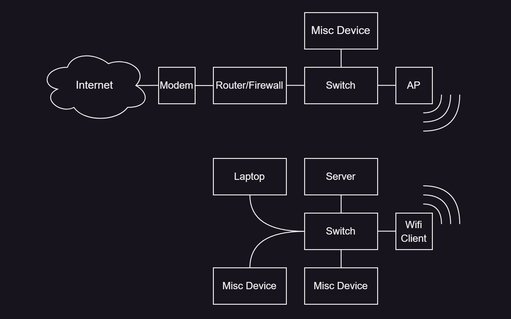

# Home Network Topology

Because of the lack of ethernet at my house, as well as to enable flexibility when moving houses, I have settled on a very odd network configuration that allows high throughput to all of my servers, and keeps connectivity to the rest of the network via Wifi, even for devices that are ethernet only.

Why not powerline? Sending data over those copper cables is not what they're intended for, and it also assumes that no noisy equipment is running on the same circuit. Also there are security concerns, unless you get powerline adapters that have passwords etc etc, which is too much hassle. I personally haven't tried powerline, but given that I've had no issues with Wifi, even in a somewhat congested area, it'll be what I'm going to stay with for the forseeable future.

## Wifi Client Devices

These are exactly what they sound like. They connect to the Wifi network like any other device would, and are often able to output the data packets via ethernet. Think of them as Wifi to Ethernet adapters (for download, and Ethernet to Wifi for upload). These typically advertised for devices like TVs and such where they may not have Wifi, but do support networking.

I am using them as an "ethernet bridge" for my network setup.

My current Wifi client device is a TP-Link TL-WA1201, which isn't great to use (has DNS issues and throws a fit if I change settings sometimes, and can only do one wifi frequency (2.4 or 5 GHz) in client mode despite having multiple antennas) and definitely sub-optimal, but it works for now. **I am open to suggestions for alternative client devices.** I tried configuring a Cisco AP to be a client device, but was not successful (connected, no packets sent).

## Design

Using a dedicated AP (as outlined in the Cisco Posts for [flashing](../2022-ciscoWAP/ciscoFlash.md) and [configuration](../2022-ciscoWAP/ciscoConfig.md)), this is my network setup

It has more benefits than just gigabit access to anything in my room! When reinstalling operating systems, having a spare ethernet port to download drivers (as opposed to USB'ing them over) is so much nicer.

Furthermore, any packets that leave my room aren't actually bottlenecked by the Wifi connection (which is rock solid, around 300 Mb/s, and I've _never_ had issues with it dropping), but rather my ISP connection (capped at 60 Mb/s).

(Wondering where my desktop is? Check out [this post](../frameworkLaptop/frameworkLaptop.md) for more details, but tldr is that I don't use one. I dock my laptop so my laptop is my desktop.)