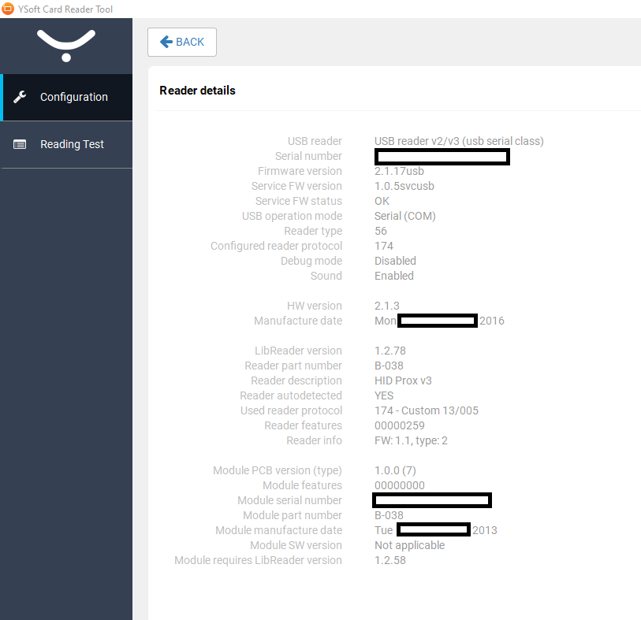
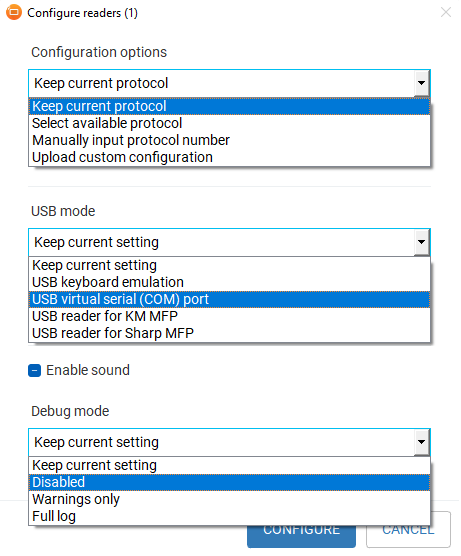
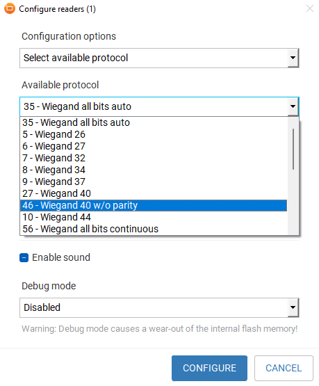

# RFID Reader Thoughts

I got an old Y Soft Corp. RFID reader in an auction crate ages ago, and wanted to experiment with it.

Plugging it into USB on a linux machine yields `Bus 001 Device 001: ID 214c:0203 Y Soft Corporation USB card reader v2` which was shocking to me that it recognised it.

Digging through google, I found [this document](https://fccid.io/XUY0YX0MU02016/User-Manual/User-Manual-2068493.pdf) which led me to install usbrdrtool on my linux machine. However, as the device was from YSoft, it should use the vendor specific software application.

Booting into windows, I launched `YSoft_Card_Reader_Tool.exe` (SHA256 `30be7204ddad37c97b9328a37d3a8b1a927b9ebebab2dd5e4b00a9ab53ddb2c9`), which let me configure the reader as a USB Serial Device (COM Ports and all). I had to use Windows cause I couldn't find a linux binary for the card reader tool.

Booting back into Linux, I could open the com port (`$ screen /dev/ttyS0`), but it wouldn't register anything when scanning cards (no noises or anything) (I should note here that when I power on the card reader, it beeps a small notification tone, and also did this when configuring it in Windows).

I booted back into Windows and had another look at the card reader tool, from which I found the following information.

From the first image, it looks like a HID Prox v3 reader for the HID Proximity Standard, which is for 125 kHz cards only. This makes sense as to why none of my cards weren't working, as they were 13.56MHz cards, not 125 kHz.

For now I'm done here, but may update if I ever get some 125kHz cards in.
