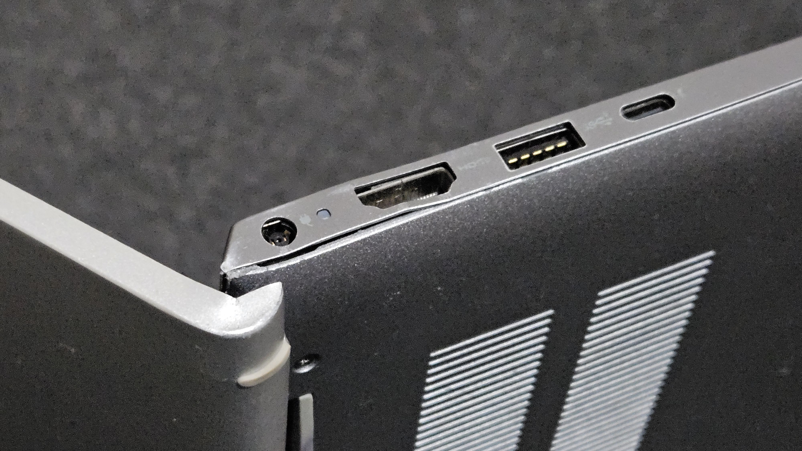
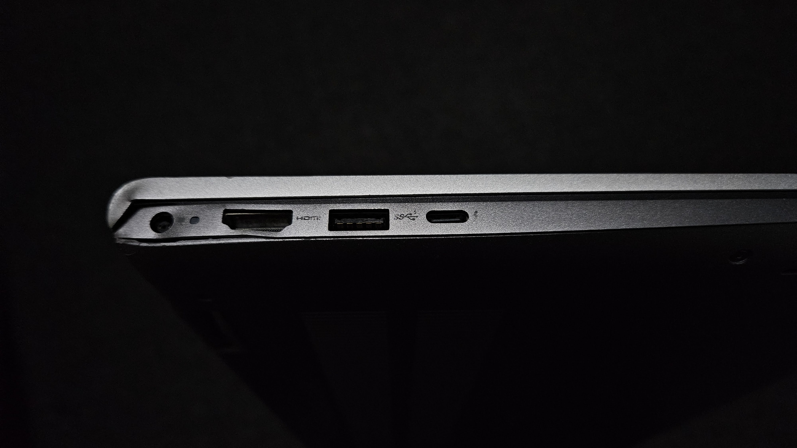
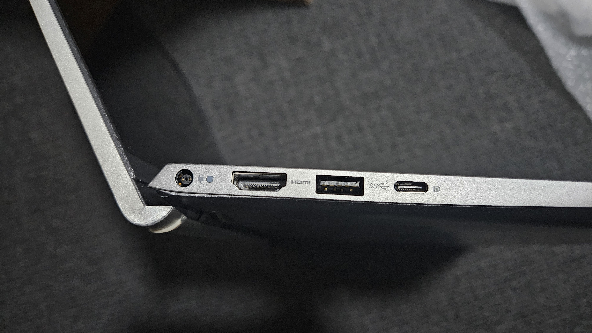

# Dell Inspiron Repair

We're getting a few of these repair projects huh.

This is a Dell Inspiron 5510.

## Acquisiton

A friend's laptop was noticibly bent (presumed battery, keyboard deck was bent upwards towards screen), and keys had started to die (c, v, b, f, g, r, t) and would not respond. Troubleshooted to be a hardware issue by reinstalling OS (no change) and plugging in external keyboard (keys work on external keyboard).

As the laptop was considered a writeoff (outside Dell's 1 year warranty), they decided to give it to me.

## Fix

Briefly disassembled to investigate battery issue. Turns out that the bend is from the layout of the bag pressing against the keyboard. This also likely contributed to the keys dying, but can't say for certain. 

Removing the motherboard, and the keyboard did not appear to be repairable easily, so put it together and reached out to Dell Warranty Support.

## Dell Support

Dell support was very nice, and other than leaking my friend's details when asking for address confirmation (remember this was bought by a friend), were actually helpful and offered to send a quote over.

### Quote

The quote provided was AUD\$220 for a repair. This was more than I was willing to spend (+$\infty$% more than what it cost for me to acquire the laptop), so I emailed back asking if it was covered under Australian Consumer Law.

Surprisingly, they were happy to cover it assuming no damage on the unit, and soon after emailed me a shipping label. We'll get back to this shipping label.

As there were some physical damage to the unit (it had been dropped on the corners, but unrelated to the keyboard dying), I replied back with images, and asked for an assessment. They unfortunately retracted their free quote, and asked again for $220.

It was only after the above, that the shipping label arrived. This was still for the "free repair if undamaged" quote, so 🤞 I was hoping. I shipped it off.

Images of damage below.

## Shipping

Uneventful.

## Reception

Arrived today at time of writing. I opened it expecting that the unit had not been touched, and that they shipped back the same box (box was prepped by post office workers, so I didn't know what the box used looked like), but opening up, they had replaced the entire top deck, and by extension repaired the keyboard!

## Lessons Learnt

Know your rights! Australian Consumer Law requires the the _retailer_ (not manufacturer) have warranty for the device for the _expected lifetime_ of the device (not the 1 year manufacturer warranty). Note has to be within reason, in this case a laptop is expected to last more than 2 years.

Furthermore, being _nice_ to the support personnel goes a long way to expediting your service. Word your emails nicely but genuinely, ask for clarifications, confirmation, without being an asshole. If you hold grudges against the company, it's an issue with the _company_, and the poor support rep does _not_ deserve any rudeness. Instead of saying _your warranty_ (directed, pointed at the person), you can say _[Company]'s warranty_ (directed, but not at the person on the other end). 

Be nice in the world, and you can go on to do great things :)