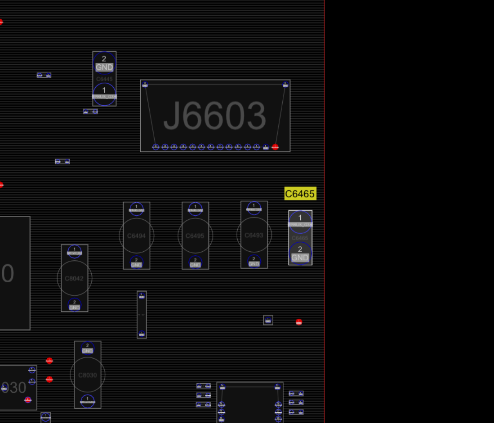
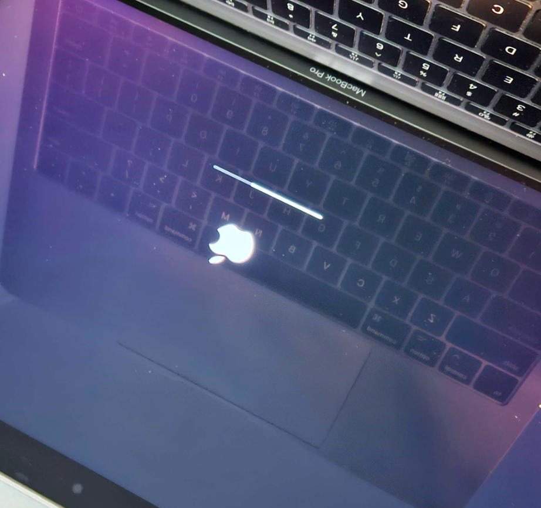
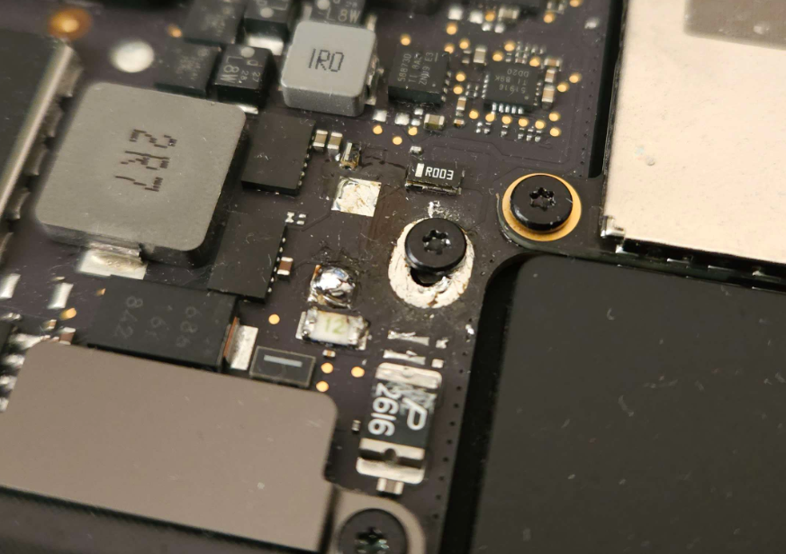
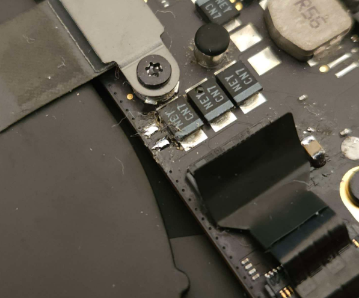
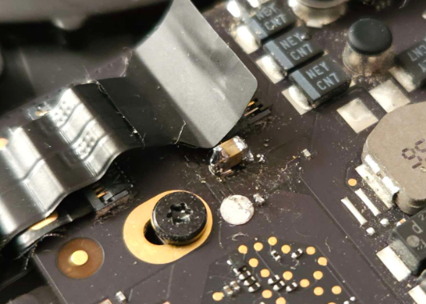
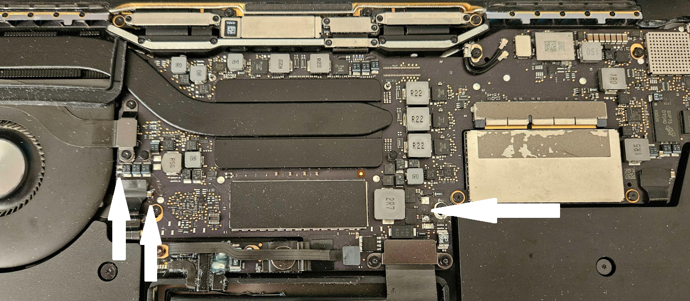
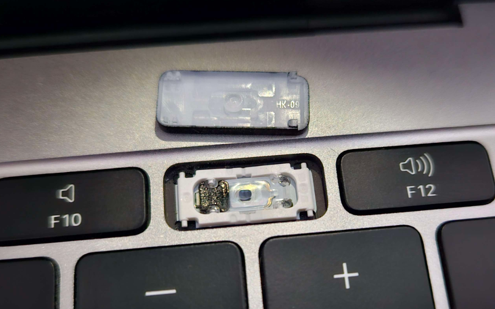

# Macbook Pro Repair

[Insert brief rant about Apple's horrible naming scheme for anything other than the iPhone]

Model Number:
- A1708
- EMC 3164
- 820-00875
- MacBookPro14,1
- 13-inch, 2017, Two Thunderbolt 3 ports

How is there no way to look up the model number based on the serial number?!??!?!

## Purchase

Was bought using a can of energy drink. We've reverted to the barter system.

## Death

I was _told_ at least, that the device was used for lightweight gaming, when, whilst on and functioning normally, suddenly died and would not turn on.

## Initial Impressions

Removed bottom cover for initial inspection, did not find any evidence of misuse, liquid damage, corrosion, or anything otherwise suggesting issues. No signs of magic smoke release from smelling either.

Notable is that the battery is slightly puffed up, so spicy pillow incoming. It does appear to be discharged, so somewhat safe.

Cleaned out the display, surface residue (user applied stickers), screen residue (body oils and rubber coating degrading)

### Battery

Spicy. Current voltage is 2.x V, which tells you all you need to know (basically dead).

### Board

No issues visually.

## Diagnosis

Plugged in to charge, the device would draw 0.4W from the wall (I do not have a USB C voltage/current detector).

Disassembled the unit to find out more. 

### PP busses

Utilising online resources (mostly Louis Rossmann) and a multimeter, when plugged in, `PP3V3_G3H` is present on the USB C port farther away from the hinge, but the USB controller closer to the hinge seems to be boot looping at the voltage level.

However, `PPBUS_G3H/PPVBAT_G3H_CHGR_REG` is not present. Measuring resistance shows that there is a 1.4 Ohm short to ground on the rail somewhere. I'm unsure whether or not it's before or after the fuse (F7000), so it's been difficult to diagnose/troubleshoot.

(Photo credit Louis Rossmann)

It doesn't appear to be the Capacitor C7050, or C6445. I know this cause I de-soldered and re-soldered these components (painfully). I also managed to accidently knock off C8187 while removing C6445, which is unfortunate which hopefully will be fine. The system still draws 0.4W, so I assume it is fine. I started with these components as they appear to be common failure points.

I haven't been able to inject voltage yet to detect the issue with a thermal camera, but this would be the next step.

## Thermal Diagnosis

I borrowed a lab power supply from work, and started injecting voltage at the C7050 solder pads (I destroyed the capacitor C7050, hoping the voltage bus still works).

Starting at 1V and checking all the capacitors connected to `PPVBAT_G3H_CHGR_REG`, nothing seemed warm. Moving onto `PPBUS_G3H`, nothing appeared warm either, so I upped the voltage to 1.7V. Feeling around the board, the C6465 Capacitor was extremely hot to the touch, so much so that I felt the need to run my finger under cold water in case it burnt.

Well, at least I know where the issue is now.

Note that I used my finger as a substitute thermal camera. Worked well enough for this purpose at least hehe.

I ripped off the capacitor and cleaned up the solder pads. (I should clarify, I de-soldered the capacitor)

## Repaired

Plugging the system back in now, it draws 14+W from the wall, and `PPBUS_G3H` measured around 12.8V, which is excellent news.

Even better news was after placing it back in the chassis and plugging it in there, it turned on without issue and loaded into the login screen!

I re-assembled the whole machine and wiped it (as requested from the seller).

Most of the resources utilised to action this repair is by Louis Rossmann. A very similar diagnosis process is covered [here](https://www.youtube.com/watch?v=S8rdaJQQVqg). You might recognise the "owie!" test in that video, was the main inspiration for my own "owie!" test.

## Photos

Here's a photoshoot of the repaired system.

Note the locations that were soldered.

## Dead USB Controller

While I was previously probing around on the board, trying to establish if `PP3V3_G3H` was present (the precursor voltage bus to `PPBUS_G3H`), I found that one of the USB controllers was boot looping at the voltage level. Now that the laptop is fixed, I can indeed confirm that the USB controller closer to the hinge is dead and cannot charge the laptop.

## Stability Testing

Considering I just ripped off two capacitors (C6465 cause it was dead, and C7050 cause I killed it while de-soldering), it would be prudent to test the stability of the voltage bus. This is ongoing as I write this.

## Apple Store

Overall nothing's changed from my past experiences with interacting there. The people are really nice and friendly, but heavily constrained by what Apple allows them to do.

The 2016-2019(?) models of Macbook Pros and Macbooks (not sure if Air was ever affected) had issues due to their butterfly keyboard, so there is a service program to repair them if they are ever dodgy. Whilst this laptop didn't have any keys that was outright dead/malfunctioning, all of the function keys were extremely sticky feeling, so I booked in for a repair.

Going in, explained the problem, they were more than happy to replace a few select keys, and a few extra, for some reason, but refused to replace the keyboard in its entirety, as a 5 year old laptop is deprecated already. A very green company indeed, Apple.

After collecting the device, I noticed that this had somehow made the problem worse, now F11 genuinely isn't responding properly. I asked about this in the store, but they refused to re-investigate unless I re-book another appointment, despite being able to (and having) looked up the service details from just then.

They also managed to kill the keyboard backlight somehow.

Back we go I guess.

## Apple Store II, Electric Boogaloo

Booked appointment

\*record scratch*

Upon reboot, backlight works, which is good. 

On second thought, wouldn't there be a cheaper way?

## Keycap Repair

I looked online and there's plenty of MBP 2017 era keycap removal videos/guides online, so I followed those. There didn't seem to be anything wrong with the keycap or the membrane, it was extremely clean.

Looking closer, the membrane is fully functional when the key is removed, so it appeared that the key nubbin in the middle of the plastic cap wasn't designed to spec, and did not protrude out enough to poke the membrane hard enough, to register a keystroke. The solution here is to make the protrusion taller.

How is this done? I used thin layers of superglue to do this. Put some superglue on the page, use tweezers to move the superglue onto the cap, and ensure that it is mostly flat. I repeated this twice with the F11 key, and once with the F12 key, and now they are fully functional without any issues.

Beat that, Apple!