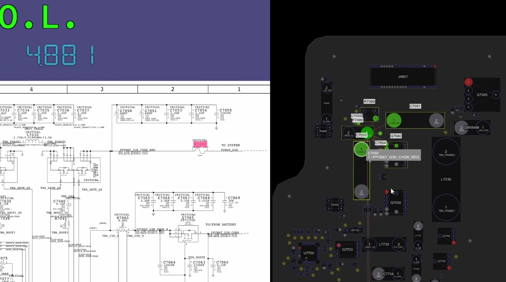

# Macbook Pro Repair

[Insert brief rant about Apple's horrible naming scheme for anything other than the iPhone]

Model Number:
- A1708
- EMC 3164
- MacBookPro14,1
- 13-inch, 2017, Two Thunderbolt 3 ports

How is there no way to look up the model number based on the serial number?!??!?!

## Purchase

Was bought using a can of energy drink. We've reverted to the barter system.

## Death

I was _told_ at least, that the device was used for lightweight gaming, when, whilst on and functioning normally, suddenly died and would not turn on.

## Initial Impressions

Removed bottom cover for initial inspection, did not find any evidence of misuse, liquid damage, corrosion, or anything otherwise suggesting issues. No signs of magic smoke release from smelling either.

Notable is that the battery is slightly puffed up, so spicy pillow incoming. It does appear to be discharged, so somewhat safe.

Cleaned out the display, surface residue (user applied stickers), screen residue (body oils and rubber coating degrading)

### Battery

Spicy. Current voltage is 2.x V, which tells you all you need to know (basically dead).

### Board

No issues visually.

## Diagnosis

Plugged in to charge, the device would draw 0.4W from the wall (I do not have a USB C voltage/current detector).

Disassembled the unit to find out more. 

### PP busses

Utilising online resources and a multimeter, when plugged in, `PP3V3_G3H` is present on the USB C port farther away from the hinge, but the USB controller closer to the hinge seems to be boot looping at the voltage level.

However, `PPBUS_G3H/PPVBAT_G3H_CHGR_REG` is not present. Measuring resistance shows that there is a 1.4 Ohm short to ground on the rail somewhere. I'm unsure whether or not it's before or after the fuse (F7000), so it's been difficult to diagnose/troubleshoot.

(Photo credit Louis Rossmann)

It doesn't appear to be the Capacitor C7050, or C6445. I know this cause I de-soldered and re-soldered these components (painfully). I also managed to accidently knock off C8187 while removing C6445, which is unfortunate which hopefully will be fine. The system still draws 0.4W, so I assume it is fine.

I haven't been able to inject voltage yet to detect the issue with a thermal camera, but this would be the next step.

## Thermal Diagnosis

to be updated soon.