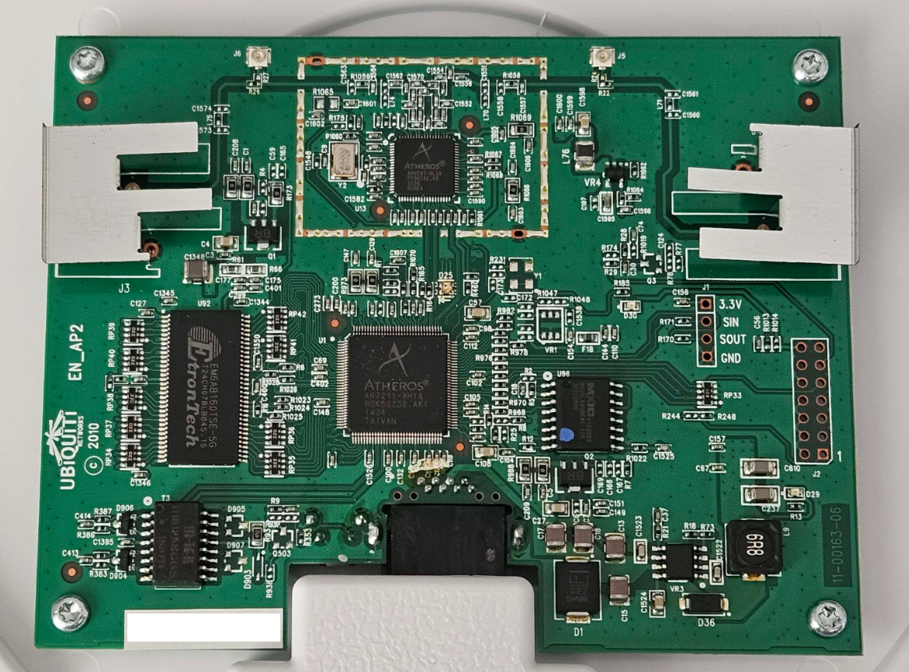

# Flashing OpenWRT onto Unifi APs

I don't think it's really hacking or anything at this point, it's just running third party firmware on it, and it's not really rooting either, as you get root shell out of the box via sudo (read on to find out more)


## Unifi AP

The Unifi AP (note: not the AP AC, this is the 802.11b/g/n model ONLY, no 802.11ac support) is something of an enigma, given that Ubiquiti seems to be taking the Apple approach of product listing, absolutely nuking the hell out of any old hardware product pages and making them essentially obsolete simply by hiding basic information such as specs and required voltage.

The naming scheme is also trash, as I have to google `unifi ap -ac` to prevent being flooded by all the irrelevant results pertaining to the newer version of their APs.

Speaking of which, these things are 24VDC PASSIVE PoE! What the hell! If you plug the wrong cable in, you destroy your laptop. Sucks ass. Luckily I was able to borrow a 24V Ubiquiti PoE injector to play around with this hardware, but why??? 48V PoE is perfectly fine of a standard.

### Hardware



Looks pretty bog standard for an AP, two antennas with option of u.FL breakout (need to move the SMD to connect the correct solder pads though). Looks cool.... omg is that serial in the mid-right? 3V3, Signal In, Signal Out, Gnd?!

(spoiler: it doesn't work, I tried.) Unfortunately SOUT was consistently 2.67V for me without fluctuation, implying that no signals were being sent (otherwise should be alternating between GND and 3V3 high). Same with the JTAG on the far right, mostly GND, otherwise similar pinout to the "serial" header.


### nmap

If you nmap enumerate a UAP (remember, \*not* AC), it will only show the ssh port open.

```
Starting Nmap 7.80 ( https://nmap.org ) at 2024-01-XX XX:XX UTC
Nmap scan report for 192.168.X.X
Host is up (0.0035s latency).
Not shown: 65534 closed ports
PORT   STATE SERVICE
22/tcp open  ssh

Nmap done: 1 IP address (1 host up) scanned in 5.99 seconds
```

### ssh

shelling into the AP using `ubnt/ubnt` as the credentials lands you in a busybox shell, not unlike the [technicolor dja0231](../2023-technicolor/technicolor.md) that I explored a while back.

```
~$ ssh ubnt@192.168.X.X
ubnt@192.168.X.X's password:


BusyBox v1.25.1 () built-in shell (ash)


  ___ ___      .__________.__
 |   |   |____ |__\_  ____/__|
 |   |   /    \|  ||  __) |  |   (c) 2010-2019
 |   |  |   |  \  ||  \   |  |   Ubiquiti Networks, Inc.
 |______|___|  /__||__/   |__|
            |_/                  https://www.ui.com/

      Welcome to UniFi UAP!

UBNT-BZ.v4.0.42# 

UBNT-BZ.v4.0.42# cat /etc/os-release
NAME="LEDE"
VERSION="17.01.6, Reboot"
ID="lede"
ID_LIKE="lede openwrt"
PRETTY_NAME="LEDE Reboot 17.01.6"
VERSION_ID="17.01.6"
HOME_URL="http://lede-project.org/"
BUG_URL="http://bugs.lede-project.org/"
SUPPORT_URL="http://forum.lede-project.org/"
BUILD_ID="r3979-2252731af4"
LEDE_BOARD="ar71xx/ubntgen1"
LEDE_ARCH="mips_24kc"
LEDE_TAINTS="no-all mklibs busybox"
LEDE_DEVICE_MANUFACTURER="LEDE"
LEDE_DEVICE_MANUFACTURER_URL="http://lede-project.org/"
LEDE_DEVICE_PRODUCT="Generic"
LEDE_DEVICE_REVISION="v0"
LEDE_RELEASE="LEDE Reboot 17.01.6 r3979-2252731af4"
UBNT-BZ.v4.0.42# cat /proc/cpuinfo
system type             : Atheros AR7241 rev 1
machine                 : Ubiquiti UniFi
processor               : 0
cpu model               : MIPS 24Kc V7.4
BogoMIPS                : 265.42
wait instruction        : yes
microsecond timers      : yes
tlb_entries             : 16
extra interrupt vector  : yes
hardware watchpoint     : yes, count: 4, address/irw mask: [0x0ffc, 0x0ffc, 0x0ffb, 0x0ffb]
isa                     : mips1 mips2 mips32r1 mips32r2
ASEs implemented        : mips16
shadow register sets    : 1
kscratch registers      : 0
package                 : 0
core                    : 0
VCED exceptions         : not available
VCEI exceptions         : not available

```

The OpenWRT community had some very nice [guides](https://openwrt.org/toh/ubiquiti/unifi_ap) for installing OpenWRT onto the AP, which I tried out to no avail. If I had only paid attention to the first line on the page, it reads

> As for July 2018, Ubiquiti seems to have blocked custom firmware installation possibility by using signatures on all 3.7 and later brand firmwares. As long as there is no brand pre-3.7 firmware available (in order to downgrade) for UAP-v2 devices, installing OpenWrt/LEDE could be impossible, as seen on the forum [....]

which is really unfortunate! Especially when you can't even find basic specs for your product, forget about finding firmware files, Ubiquiti!


### Installing OpenWRT

As I was considering alternatives, I left it for a few days, and then dug around in the Unifi App. Connecting one of the APs that I bought (second hand), I noticed that it had a firmware update option. It turns out that the seller hadn't updated all of the APs, and I had one that was still on version 3.9.x!

Quickly, I downloaded the binaries, copied them over, and attempted to install.

Doing so kills your ssh session (intentionally, I believe) and also blinks the LED Orange and Green, signifying a firmware update in progress (it'd be good to check this against a manufacturer spec sheet eh?). When finished, it should blink Green only.

Note the ssh user is different since I had set up the AP via the phone app. I also copied over both files 

```
~$ scp openwrt-22.03.5-ath79-generic-ubnt_unifi-squashfs-* admin@192.168.X.X:.
admin@192.168.X.X's password:
openwrt-22.03.5-ath79-generic-ubnt_unifi-squashfs-factory.bin         100% 5952KB   1.8MB/s   00:03
openwrt-22.03.5-ath79-generic-ubnt_unifi-squashfs-sysupgrade.bin      100% 5952KB   1.9MB/s   00:03

~$ ssh admin@192.168.X.X
admin@192.168.X.X's password:


BusyBox v1.11.2 (2018-01-04 14:40:48 MST) built-in shell (ash)
Enter 'help' for a list of built-in commands.


  ___ ___      .__________.__
 |   |   |____ |__\_  ____/__|
 |   |   /    \|  ||  __) |  |   (c) 2010-2018
 |   |  |   |  \  ||  \   |  |   Ubiquiti Networks, Inc.
 |______|___|  /__||__/   |__|
            |_/                  http://www.ubnt.com

      Welcome to UniFi UAP!

BZ.v3.9.19# ls
cfg
openwrt-22.03.5-ath79-generic-ubnt_unifi-squashfs-factory.bin
openwrt-22.03.5-ath79-generic-ubnt_unifi-squashfs-sysupgrade.bin
BZ.v3.9.19# sudo cp openwrt-22.03.5-ath79-generic-ubnt_unifi-squashfs-factory.bin /tmp/fwupdate.bin
BZ.v3.9.19# cd /tmp
BZ.v3.9.19# nohup syswrapper.sh upgrade2
nohup: appending output to nohup.out
Connection to 192.168.X.X closed by remote host.
Connection to 192.168.X.X closed.

~$ 
```

After waiting for the system to reboot, I connected to the AP on 192.168.1.1 over ethernet on a browser, allowing me to log into the web interface for OpenWRT and login with `root/` (blank password). From here, under `Network > Interfaces` I changed the `br-lan` interface from `General Settings > Static IP` to `DHCP Client` and `Firewall Settings > WAN` to `LAN`, as well as disabling the DHCP on the interface (`DHCP Server > Ignore interface`) so I can access it from my home network.

Now it's just a bog standard Wifi AP, running OpenWRT, which means, funnily enough, it could be an entire nat filter/router/firewall/ap for a home network, with the downside that you don't get any LAN ethernet ports, especially considering how much power it draws (3.2W idle)

Root shell over ssh is also accessible, with a new splash screen now

```
~$ ssh root@192.168.X.X

BusyBox v1.35.0 (2023-04-27 20:28:15 UTC) built-in shell (ash)

  _______                     ________        __
 |       |.-----.-----.-----.|  |  |  |.----.|  |_
 |   -   ||  _  |  -__|     ||  |  |  ||   _||   _|
 |_______||   __|_____|__|__||________||__|  |____|
          |__| W I R E L E S S   F R E E D O M
 -----------------------------------------------------
 OpenWrt 22.03.5, r20134-5f15225c1e
 -----------------------------------------------------
=== WARNING! =====================================
There is no root password defined on this device!
Use the "passwd" command to set up a new password
in order to prevent unauthorized SSH logins.
--------------------------------------------------
root@OpenWrt:~#
```


## Downgrading UAP Firmware

from Ubiquiti's release page [here](https://community.ui.com/releases/UAP-USW-Firmware-4-0-30-10217/602dd4ce-d85c-4de4-8b5f-9aab51ef1942), note:

> UAP, UAP-LR, UAP-IW, UAP-OD and UAP-OD5 cannot be downgraded from firmware 4.0.17+ to an earlier release.

Why this restriction exists is frustrating, especially when it's listed as a "known issue" but appears to be intentional. I was able to downgrade my 4.0.42 UAP to 4.0.30 by ssh'ing in and typing

```
UBNT-BZ.v4.0.42# upgrade http://dl.ui.com/unifi/firmware/BZ2/4.0.30.10217/BZ.ar7240.v4.0.30.10217.190402.2213.bin
Downloading firmware from 'http://dl.ui.com/unifi/firmware/BZ2/4.0.30.10217/BZ.ar7240.v4.0.30.10217.190402.2213.bin'.

Waiting firmware upgrade ..
Connection to 192.168.X.X closed by remote host.
Connection to 192.168.X.X closed.

~$ ssh ubnt@192.168.X.X
ubnt@192.168.X.X's password:


BusyBox v1.25.1 () built-in shell (ash)


  ___ ___      .__________.__
 |   |   |____ |__\_  ____/__|
 |   |   /    \|  ||  __) |  |   (c) 2010-2019
 |   |  |   |  \  ||  \   |  |   Ubiquiti Networks, Inc.
 |______|___|  /__||__/   |__|
            |_/                  https://www.ui.com/

      Welcome to UniFi UAP!

UBNT-BZ.v4.0.30#
```
which is, fine, it shows that you can downgrade (and you may have good reason too! Firmware bugs/edge cases/etc), but the inability to downgrade past 4.0.17 is extremely frustrating.


I don't want to start decompiling binaries and firmware as that may be breaking EULA/whatever, so that's where I'm stopping my investigation. I'm keen to try out OWRT on a device, see what it can offer, and what packages I can install using opkg.
