# Pwnagotchi

I made a pwnagotchi.

It was quite fun and interesting, let me practice soldering, and was generally a great project I had fun with.

## Variants

It is a Slimagotchi. I intended to carry them around with me on a carabiner belt buckle, so physical size was a concern. Furthermore, as I intended to bring it around with me all day, I wanted a larger battery than what was provide on the PiSugar S (comes with 1200mAh battery). I considered using an 18650 (~2600-3000mAh) but it was too big. However, there's a 803060 battery (8.0mm thick, 30x60mm dimensions) that fits perfectly and is available at 2200mAh, which roughly doubles the 1200mAh OEM battery.

## Parts

Physical hardware I used:

- Waveshare Screen
- Pi Zero 2W (headerless)
- 40 pin GPIO headers (bought separately)
- PiSugar S inc 1200mAh battery
- 803160/803060 2200mAh battery

## Build

Slim means removing thickness!

Desolder waveshare screen connector that won't be used. Put kapton tape over it so there's no short circuits.

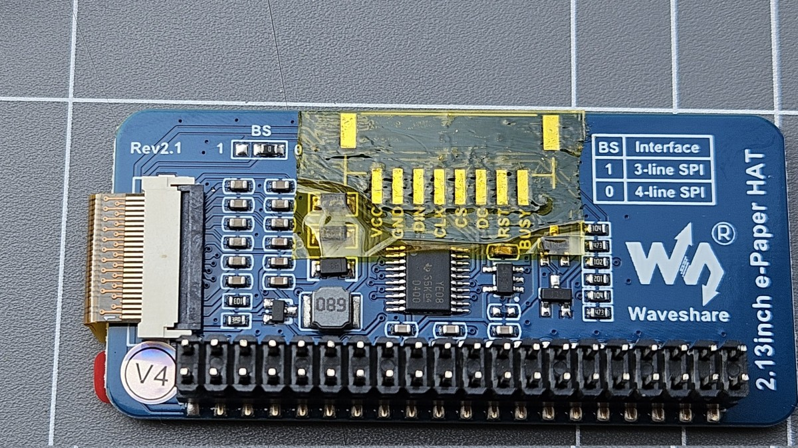

Measure out the height of pins required to mate the waveshare screen to the Pi without any plastic spacers. Solder pins to the Pi.

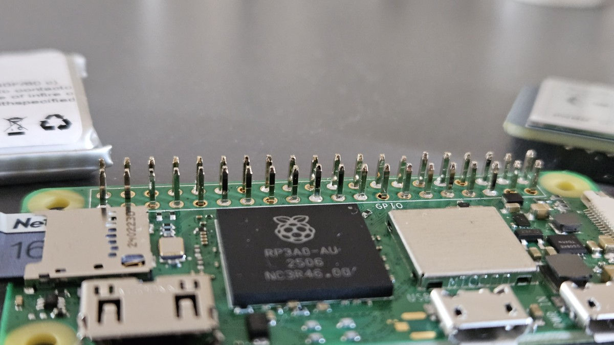

Trim excess pin lengths on the other side of the Pi to ensure the PiSugar board will fit.

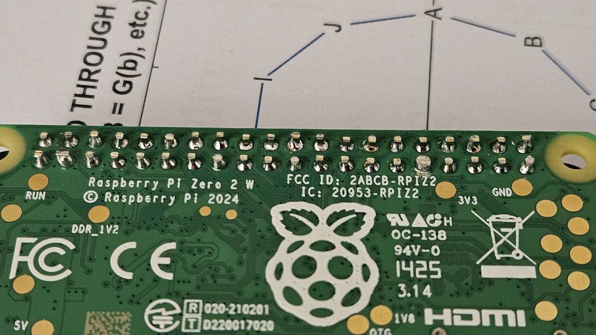

Test fit.

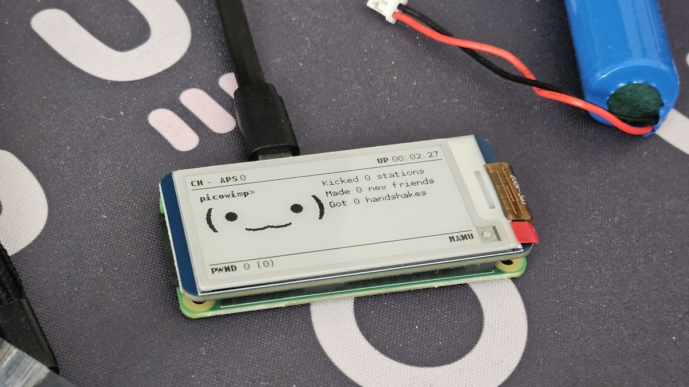

Mod the PiSugar with the 803060 battery. Desolder the old battery and re-solder the new battery. Ensure the polarity is the same (don't swap positive and negative!). 

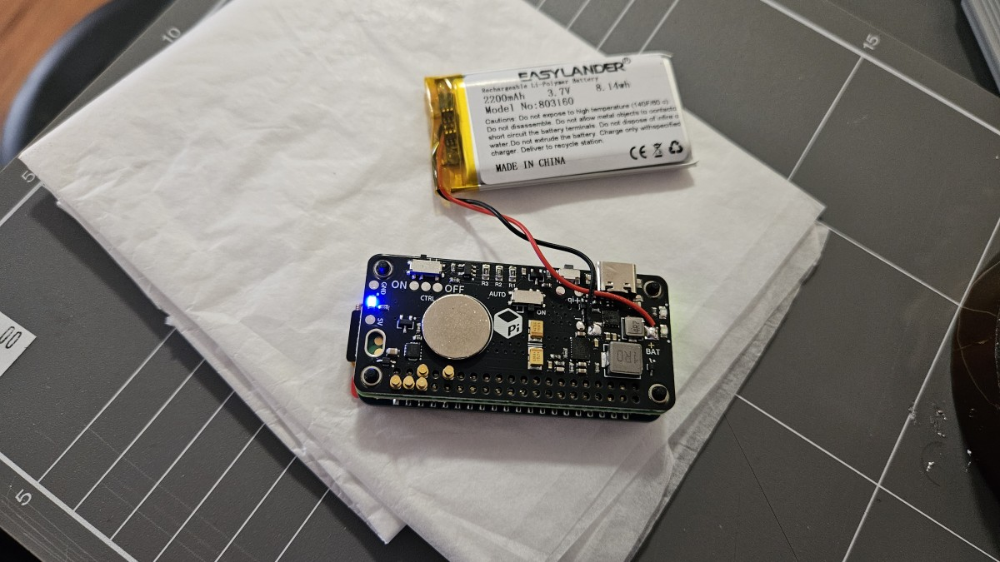

All the parts are ready for assembly.

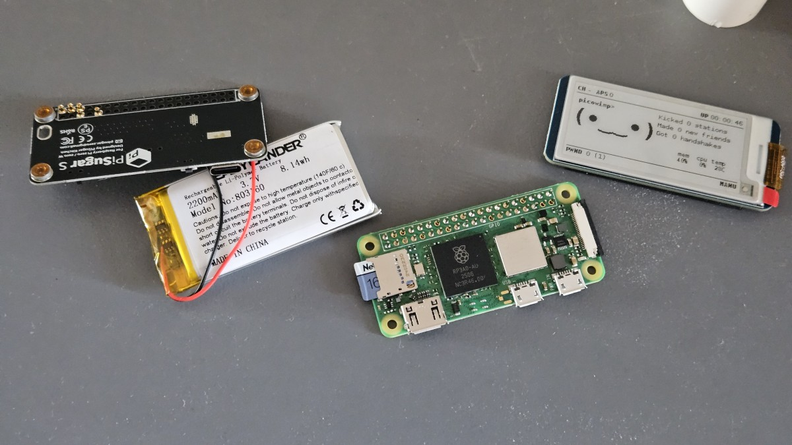

This is how slim all the electronics boards are. Pins aren't excessively long so everything sits flush with minimal air gap.

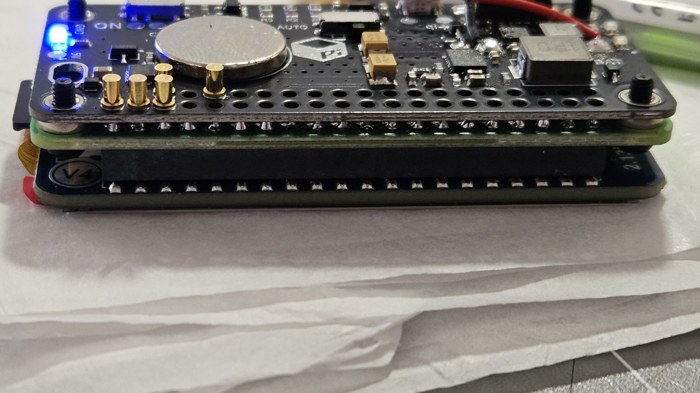

And everything stacked together.

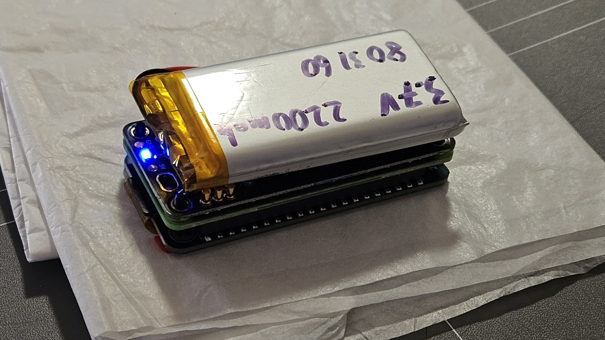

## Case

[CAD files here](https://github.com/Cubie87/pwnagotchi/) are for the above spec. Original and 803060 battery should both work, but I only modified with the 803060 battery in mind. 

Had to do a few design iterations to do fit check, etc. I utilised an existing design and modified it to fit my use case and specific quirks.

Redesign considerations include:
- Aligning ports to match my hardware
- Aligning microSD card slot to my hardware
- Trimming supports to allow the curvature of the e-ink screen to fit without creasing the ribbon cable
- Added on/off switch
- Redesigned lid mechanism

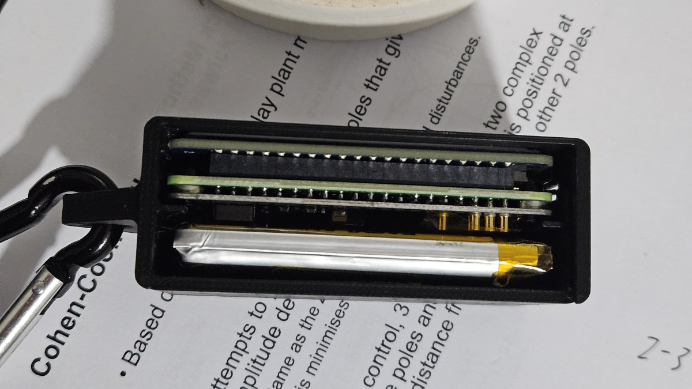
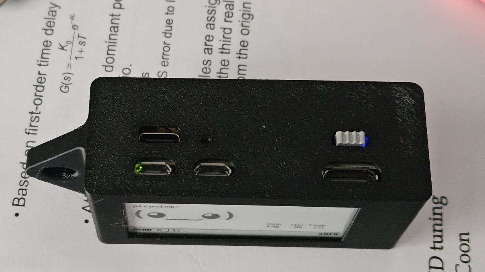
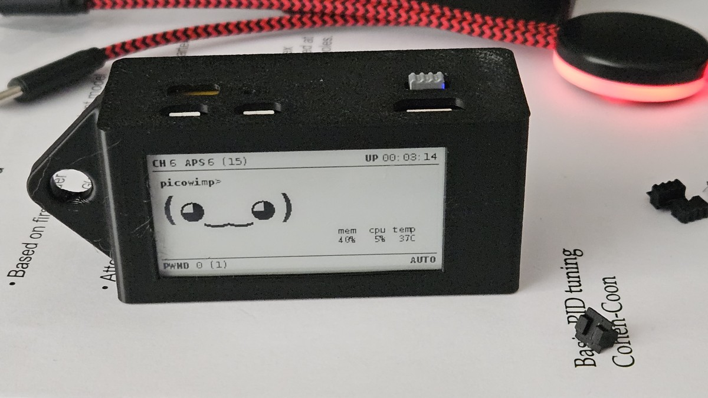
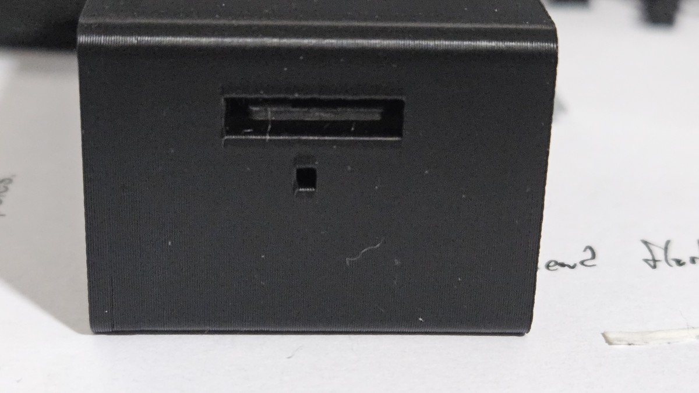
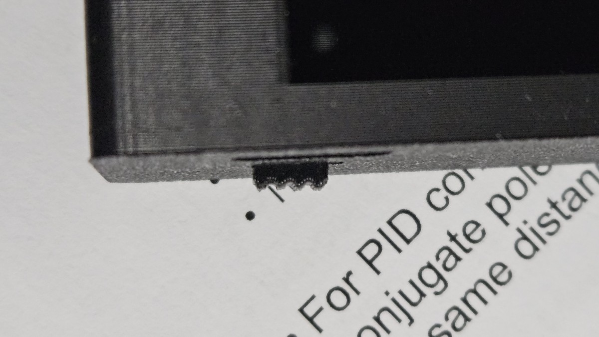

## Credits

To [pwnagotchi.ai](https://pwnagotchi.ai/) and [pwnagotchi.org](https://pwnagotchi.org/). I think the project got forked at some point which is why there's the two different resources? At least there's healthy discussion and debate in the open source community. 