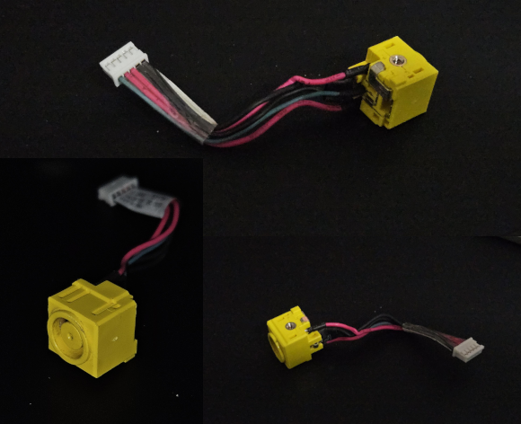
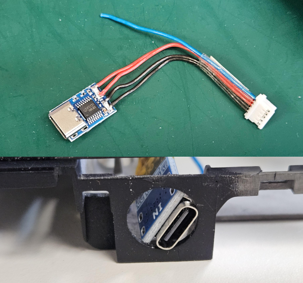
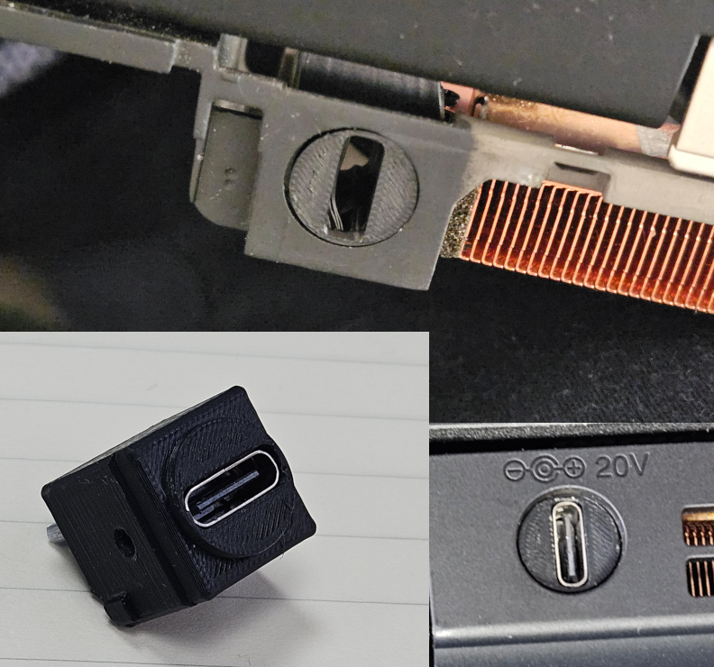

# ThinkPad T430

A friend was throwing one of these out so I figured I'd take it off their hand.

## Condition Upon Delivery

The laptop was in shockingly good condition as received, with a few stickers that were removable using some cooking oil. This has been the best way I've found to remove adhesives, is using an oil, and then some very dilute dish soap or similar. Leaves minimal residue as well if "rinsed" (wiped with baby wipes)

## RAM Upgrade

When did we stop making modular laptops? I know this is a brick, but a RAM upgrade is behind 4 screws and 2 covers, one being the keyboard. I bumped it to 16GB using some DDR3L RAM I had lying around. 1.35V efficiency for battery operation!

## Initial OS

I initially booted it into Windows 7 to test functionality. This was surprisingly functional! It idles at around 1GB of ram, but still eats significant disk space. Furthermore, most modules seemed to appear without issue, including display drivers! Keyboard functions were not, but that was to be expected.

## Modding the BIOS

There is [a script to run](https://github.com/n4ru/1vyrain), to mod the laptop BIOS. This does a few things:
- Remove WWAN/WLAN card whitelist
- ME disable
- Overclocking support
- Advanced menus for power/feature management

The main appeal for me, was to remove the WLAN card whitelist so I could install an 802.11ac mPCIe card.

Download file, `dd` the image to a USB, boot into it, and follow prompts. Easy and straightforward.

## WLAN Card Upgrade

Bought an Intel 7260 802.11ac card, installed. _Extremely_ straightforward. I miss truly modular laptops.

## Modding the Charge Port

I love standardising chargers, which lets me get away with only bringing one charger when out and about; USB C. 

However, this ThinkPad arrived with a _barrel jack_. Disgusting. Time to get rid of it.

This is the charging module. Conveniently 20V

De-solder, re-solder to USB C module.

It fits! Time to fill in the rest of the empty hole. 3D Printed.

Unfortunately it came out significantly recessed, and though I could move it by 400um, it would probably be better to get a new USB C module that protrudes more. More importantly, it works, and works with all chargers I've tried, even when they don't fully click into place.

## General Thoughts

I really like this laptop! 