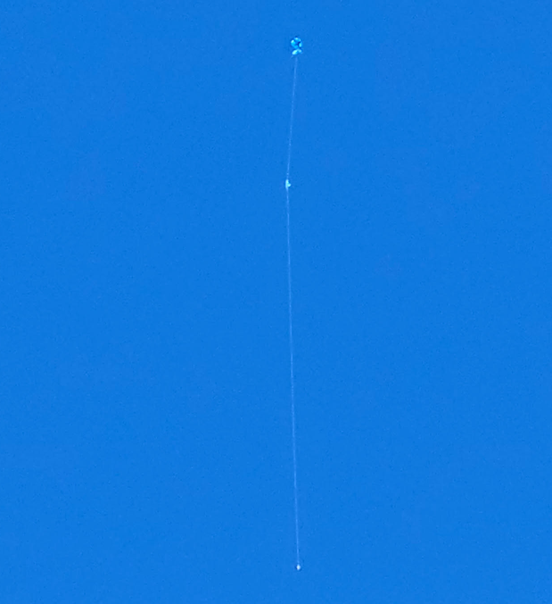
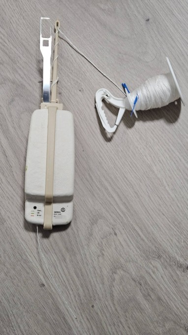
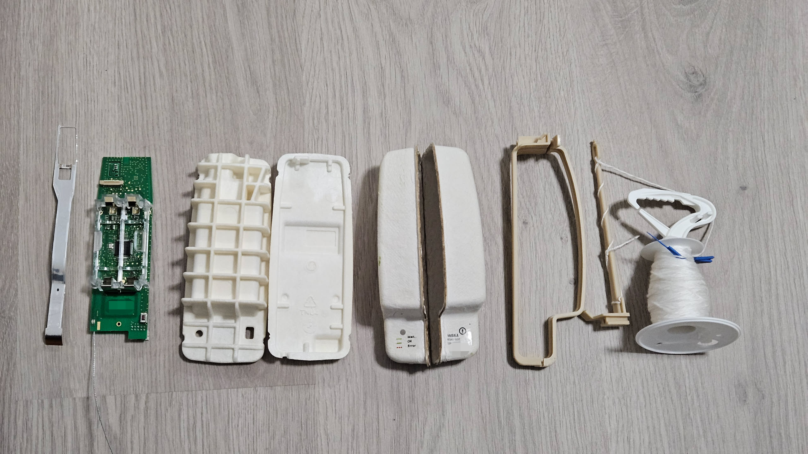

# Recovering Used Weather Balloons

## Preamble

The government (in Australia's case, the [Bureau of Meteorology (BOM)](https://www.bom.gov.au/)) regularly launches [weather balloons (radiosondes)](https://www.bom.gov.au/resources/learn-and-explore/radar-and-equipment-knowledge-centre/weather-balloons) to perform meteorology (measure weather conditions) in the atmosphere. 

These are single use and have wirelessly transmit their data to a ground receiver. This data packet format has been dissected and allows for anyone with an appropriate receiver to decode and analyse the data. As the ownership of the balloons is by a civil government organisation (non-military), and the data is benign and published on the BOM website anyway, there has not been any issues with HAM and hobbyists from receiving and looking at the data.

The most interesting piece of information that is transmitted is the radiosonde's location, in lat, long, and alt. This allows for them to be tracked, given that they will drift with the wind. Notably, the wind speed and direction varies throughout the flight, with [this cool website](https://earth.nullschool.net/) showing the various conditions at various atmospheric pressures (along with other cool visualisations)

As the sondes are designed to be disposable, there is not an effort by the BOM to recover used sondes. However, since they broadcast their exact location, radio hobbyists will occasionally drive out and recover them, as a sort of geocaching style scavanger hunt.

In that instance, it could be considered the taking of abandoned government property. Technically correct is sometimes the most fun correct.

By the way, there is an excellent website [Sondehub](https://sondehub.org/) that aggregates data from users to track radiosondes around the world. This is similar to how websites like flightradar24 and adsb.fi work to track planes, relying on geographically diverse crowdsourced receivers to upload and aggregate data.

## Hunting

On a calm Saturday morning, I woke up, and saw that a sonde was expected to land relatively closeby to my location, and so hopped in the car to chase it down. As I was still new to this, I had not yet set up a portable offline receiver station (important as receivers don't always track to landing and may cut off several hundred meters up), and instead relied on Sondehub's crowdsourced receiver network. I arrived some time before touchdown and was able to witness a strange sight, the sonde, attached to a small parachute and a disintegrated balloon, drifting down from the sky.

After a short walk, the sonde was recovered from a field. As I was able to watch the landing, the approximate location could be determined, and when combined with receiver telemetry and satellite map view, allowed for a speedy recovery.

## Electronics

This is a picture with the balloon and parachute removed.

The electronics contained within are actually fascinating. It has an STM32 microcontroller and appropriate GPIO ports to re-program them. It also has all the relevant sensors for meteorlogical functions, such as temperature, humidity, barometric pressure, as well as an apparently high quality GPS receiver. It is notable that the transmitter is reprogrammable to different frequencies (and apparently the range is very wide, in the realm of anything between 240 and 930 MHz), and important to remember that transmission on the weather balloon frequencies may not be legal.

I'm aware of at least one program that allows the sonde to be reprogrammed for various usecases, called [rs41ng](https://github.com/mikaelnousiainen/RS41ng), and is an avenue of exploration I'm still investigating. However, this being my first sonde recovery, I am tempted to leave the software as is and retain it as a display item. 

First successful recovery of weather balloon and payload! Here's hoping for more in the future.