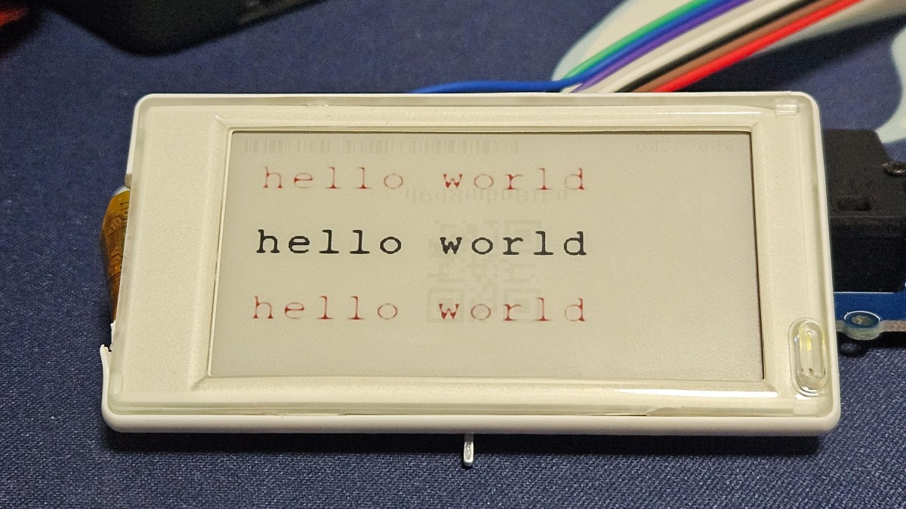
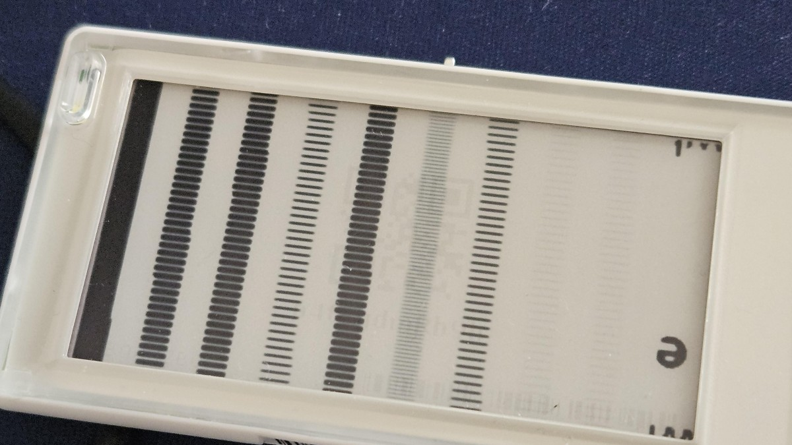
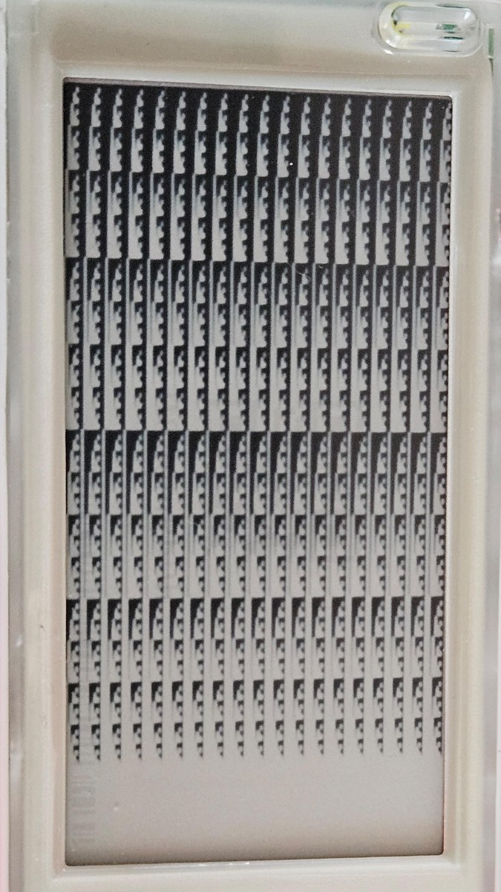
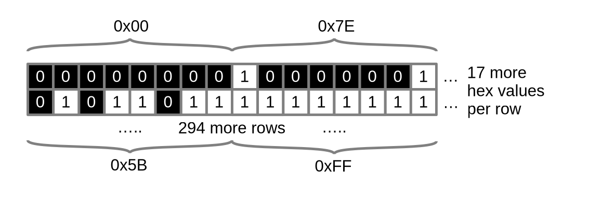
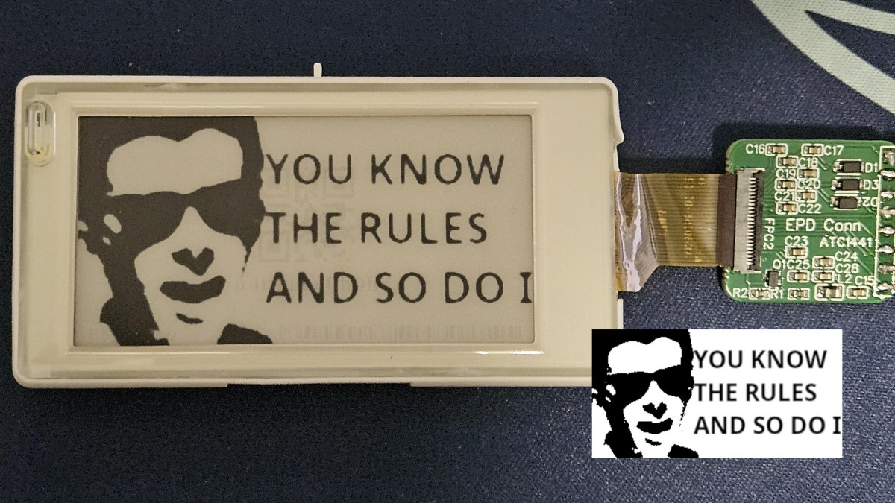

# E-Ink Price Tags

A local IoT hacking group were donated a few boxes of those supermarket e-ink price tags that are becoming more commonplace, and I've always wanted to get my hands on some to tinker and experiment with.

They came in two sizes, but the one I decided to investigate was the ses imagotag VUSION 2.6 BWR GL320.

It turns out that imagotag and vusion were two separate companies at one point, and seems to have merged? not sure about that. 2.6 refers to the screen size, 2.66 inches across, and BWR refers to the 3 colors it can display; black, white, red.


## Initial Impressions (and Credits)

The IoT group was given the tags as a previous group couldn't figure things out. Thankfully, that group had already made some EPD (E-Paper Display(???)) adapters to convert the GPIO pins to the 24 pin ZIF/Ribbon connector. This adapter is made by ATC1441 given their credentials are silkscreened onto the board, and can be [sourced from here](https://www.pcbway.com/project/shareproject/Universal_E_Paper_adapter_PCB_9b9a845c.html). If one digs into [ATC1441's github profile](https://github.com/atc1441), there's a lot of e-ink resources to be found.

However, I found a [library by jcyfkimi](https://github.com/jcyfkimi/arduino_esp32_epd_lib) which had almost the exact tags I was using, so decided to forge ahead with that. This turned out to be a good decision as we will see later.

General googling also provided datasheets which gave the display's hardware properties, specifically the resolution being 296 by 152.

## Initial Testing

Using the library by jcyfkimi, I was able to get basic patterns to display on the board, but wasn't able to do much else. They had included a font library, so could render text. This provided the first successes, allowing custom text to be rendered on the e-ink display.



That library also had a bitmap image of the waveshare logo, which was interesting. In theory that means that you can draw any arbitrary images on the display (as opposed to having to programmatically define shapes, etc), but needed more understanding. 

The bitmap is a list of hex values, specifically 5624 of them. Given that this e-ink screen had exactly 8 times that many pixels at 44992, that meant that the hex values each represented 8 pixels, at least in theory. 

## Calibration Patterns

Initially I attempted to display lines of `0x00`, `0x22`, `0x44` ... `0xff`, with `0xff` buffer in between. This gave an interesting result which wasn't too useful, but it did let me calibrate the bitmap to have 19 hex values per pixel line, and I reformatted the text file to match.



This pattern is confusing, and I wasn't sure what to make of it. Naturally I assumed that each hex value defined _something_, but had thought it would be pixel colors (reflecting back, incorrect, as e-ink is black or white, no grayscale). An LLM suggested it was dithering, which made more sense to me, though needed more experimentation.

I wasn't able to get anywhere with the above pattern, so decided to go for a more granular pattern.

```
0X00,0X00,0X00,0X00,0X00,0X00,0X00,0X00,0X00,0X00,0X00,0X00,0X00,0X00,0X00,0X00,0X00,0X00,0X00,
0X00,0X00,0X00,0X00,0X00,0X00,0X00,0X00,0X00,0X00,0X00,0X00,0X00,0X00,0X00,0X00,0X00,0X00,0X00,
0X02,0X02,0X02,0X02,0X02,0X02,0X02,0X02,0X02,0X02,0X02,0X02,0X02,0X02,0X02,0X02,0X02,0X02,0X02,
0X02,0X02,0X02,0X02,0X02,0X02,0X02,0X02,0X02,0X02,0X02,0X02,0X02,0X02,0X02,0X02,0X02,0X02,0X02,
0X04,0X04,0X04,0X04,0X04,0X04,0X04,0X04,0X04,0X04,0X04,0X04,0X04,0X04,0X04,0X04,0X04,0X04,0X04,
0X04,0X04,0X04,0X04,0X04,0X04,0X04,0X04,0X04,0X04,0X04,0X04,0X04,0X04,0X04,0X04,0X04,0X04,0X04,
...
...
...
...
0XFC,0XFC,0XFC,0XFC,0XFC,0XFC,0XFC,0XFC,0XFC,0XFC,0XFC,0XFC,0XFC,0XFC,0XFC,0XFC,0XFC,0XFC,0XFC,
0XFC,0XFC,0XFC,0XFC,0XFC,0XFC,0XFC,0XFC,0XFC,0XFC,0XFC,0XFC,0XFC,0XFC,0XFC,0XFC,0XFC,0XFC,0XFC,
0XFE,0XFE,0XFE,0XFE,0XFE,0XFE,0XFE,0XFE,0XFE,0XFE,0XFE,0XFE,0XFE,0XFE,0XFE,0XFE,0XFE,0XFE,0XFE,
0XFE,0XFE,0XFE,0XFE,0XFE,0XFE,0XFE,0XFE,0XFE,0XFE,0XFE,0XFE,0XFE,0XFE,0XFE,0XFE,0XFE,0XFE,0XFE,
0XFF,0XFF,0XFF,0XFF,0XFF,0XFF,0XFF,0XFF,0XFF,0XFF,0XFF,0XFF,0XFF,0XFF,0XFF,0XFF,0XFF,0XFF,0XFF,
0XFF,0XFF,0XFF,0XFF,0XFF,0XFF,0XFF,0XFF,0XFF,0XFF,0XFF,0XFF,0XFF,0XFF,0XFF,0XFF,0XFF,0XFF,0XFF,
```
and this gave the following "calibration" map.

### Calibration Map



I sat on this for a while, as I wasn't sure what to make of it. On one hand, the shading isn't consistent, but on the other, surely something could be made of it. 

## Realisation and Custom Outputs

After a few days, it dawned on me. The calibration map was literally counting binary as it moved down, with each row being the same binary value.

`0x00`, the top two rows, is fully black, as none of the bits were on 

(`0x00` (hex) = `0000 0000` (bin))

The bottom rows were fully white, as all the bits were on

(`0xff` (hex) = `1111 1111` (bin))

And the patterns I was seeing, was literally binary counting in increments of 2.

eg, 

`0x02` (hex) = `0000 0010` (bin) which meant that there was 1 white pixel in the position of the 1

`0x7E` (hex) = `0111 1110` (bin) which meant that all but the leftmost and rightmost pixel was white (just before halfway down)

`0x80` (hex) = `1000 0000` (bin) which meant that all but the leftmost pixel was black (just after halfway down)

This was extremely convenient, as it meant that each row of pixels was simply grouped into 19 groups of 8, and allowed for relatively simple conversions between a black and white (no grayscale) image, and a bitmap.



Looking at the pricetag vertically, per the calibration image. The display has 296 pixels vertically, so there are 296 rows of hex values.

Each hex value encompasses 8 pixels, so at 152 pixels across, there are 19 hex values per row.


After a quick LLM conversation to get a functional python script, I was able to draw custom art on the display. It takes in a 296 pixel tall by 152 pixel wide image, and converts it into a list of hex values that can be uploaded through the arduino library.




The code for this [can be found here](https://github.com/Cubie87/sesimagotag).