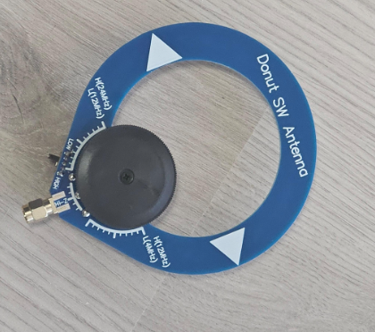
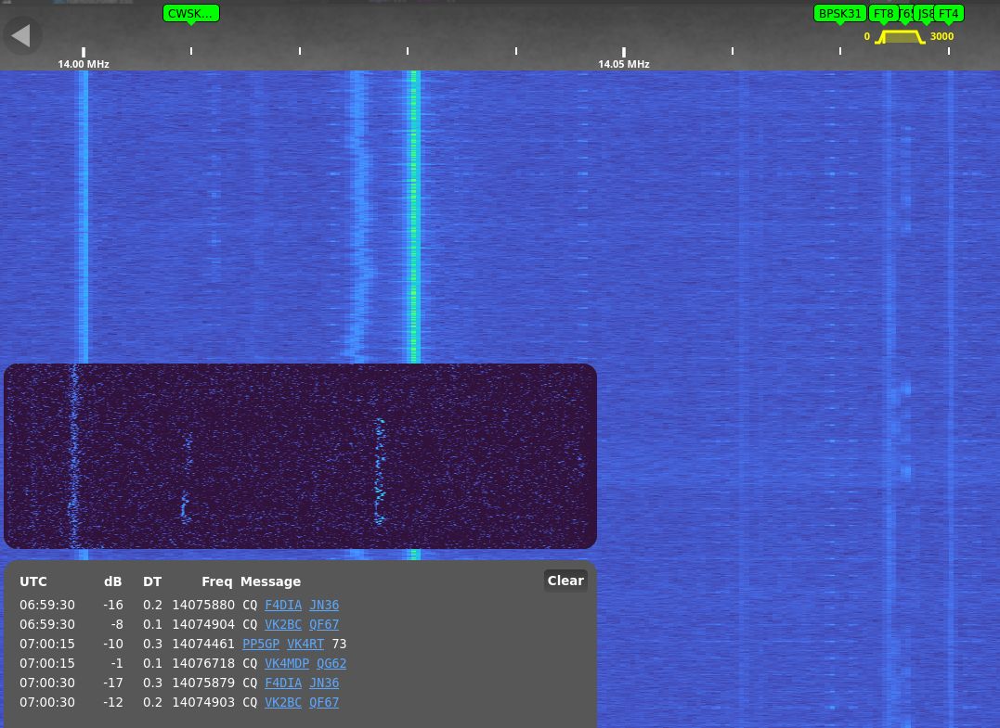
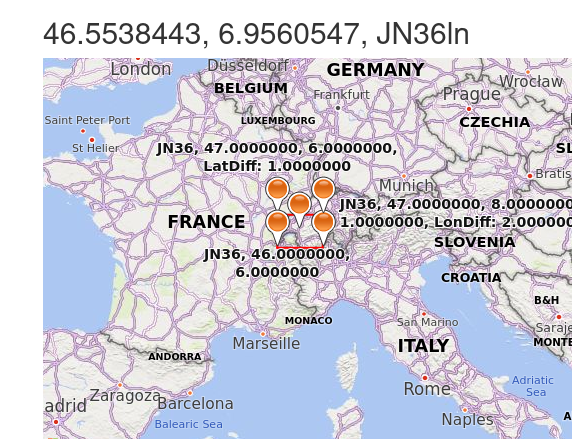

# Receiving Radio Signals From Around the World

## Background and Open Source
I'm sure some of you are familiar with the concept of "open source", where the source code of programs are open and reviewable. This can be extended to concepts such as GNU/GPL's _free_ and open source, where the _free_ stands for _freedom_ in the sense of modification and redistribution.

## Ham and Openness

Amateur Radio, or HAM Radio, to me, is _the_ original "free and open source". There's often no source code and often no computation required at all. Transmit and receive using FM, Morse, and a variety of other formats. Not only is it _free_ (freedom) and "open source", it is _protected_. Legally, you are prohibited from encryption or obfuscation on the HAM bands (amateur radio spectrum frequencies), and digital modes require you to publish the encoding standard.

## Getting into HAM

Amateur Radio licences are available from your country's radio/telecommunications authority, for Australia that is ACMA, though examiniations are overseen by local radio clubs. I got my HAM licence in May 2025, and have slowly been exploring what it involves. It was only a day course, and was quite easy due to my technical background. For context, a 14 year old was in my class and easily passed.

I will note that a HAM licence allows you to transmit, but is not required if you only wish to receive. There may be laws opposing this however (against intercepting communications which you are not an intended recipient of, etc) so may differ between jurisdictions.

## SDR

Similar to your car radio, a _Software Defined Radio_ (SDR) lets you tune into different frequencies, but unlike your car radio using physical knobs, an SDR uses software to tune itself. 

The cheapest and (in my circles) most commonly known SDR is the RTL-SDR, which is so incredibly cheap at ~$70 AUD. For context, others I've seen are the HackRF One, LimeSDR, and AntSDR, which run ~$500+. Note that the RTL-SDR can only receive, whereas the others above can also transmit.

Furthermore, the RTL-SDR can listen from around 500kHz up to 1.7 GHz, which is incredible given the price. However, you do need an antenna that is ideal for that frequency range, or different antennas for each different range.


## OpenWebRX

OpenWebRX is a software that can manage an SDR. I like it as I can access it remotely (eg, when out from my phone through a VPN), and it runs in docker.

I tried out OpenWebRX and made the following notes.

So it turns out that the `stable` docker image doesn't support RTLSDRv4 sticks, only v3, so you need to use `latest`. This information is correct as of 06/02/2026.

```yaml
services:
  openwebrx:
    image: jketterl/openwebrx:latest
    container_name: openwebrx
    privileged: true
    volumes:
      - ./openwebrx/settings:/var/lib/openwebrx
      - ./openwebrx/etc:/etc/openwebrx
    ports:
      - 8073:8073
    devices:
      - /dev/bus/usb:/dev/bus/usb
    environment:
      - OPENWEBRX_SDR_DEVICE=soapy=driver=rtlsdr,serial=00000001
      - OPENWEBRX_ADMIN_USER=admin
      - OPENWEBRX_ADMIN_PASSWORD=admin
    tmpfs:
      - /tmp/openwebrx
    restart: unless-stopped
```

remember to `sudo rmmod --force dvb_usb_rtl28xxu` before running `docker compose up -d`

However, I was pointed to OpenWebRX+ as it had more features, so tried running that instead.

## OpenWebRX+

is a open source fork of OpenWebRX, that adds more features (see above for Open Source and modification, redistribution). 

I couldn't get it working at first, but that was cause Firefox was caching data from OWRX and loading that into the OWRX+ page. Hard refresh (Ctrl+F5) helped resolve that.

```yaml
services:
  owrx:
    image: 'slechev/openwebrxplus:latest'
    container_name: owrx-mbe
    restart: unless-stopped
    ports:
      - '8073:8073'
      - '5678:5678'
      - '1073:1073'
    environment:
      # TZ: Country/City
      FORWARD_LOCALPORT_1234: 5678
      OPENWEBRX_ADMIN_USER: admin
      OPENWEBRX_ADMIN_PASSWORD: admin
      HEALTHCHECK_USB_0BDA_2838: 2
      HEALTHCHECK_USB_0BDA_2832: 1
      HEALTHCHECK_USB_1DF7_3000: 1
      HEALTHCHECK_SDR_DEVICES: 4
    devices:
      - /dev/bus/usb:/dev/bus/usb
    volumes:
      - ./openwebrxplus/etc:/etc/openwebrx
      - ./openwebrxplus/var:/var/lib/openwebrx
      - ./openwebrxplus/plugins:/usr/lib/python3/dist-packages/htdocs/plugins
    # mount /tmp in memory, for RPi devices, to avoid SD card wear and make dump1090 work faster
    tmpfs:
      - /tmp:mode=1777
```

With this setup, I was able to verify that my radio transmissions from my handheld could hit local repeaters.


## Antennas

Preface this on how receiving antennas differ from transmit antennas, as when receiving, you're not pumping 10W? 50W? 100W? 400W? into some wire (possible fire risk).

I bought some basement bin loop antennas off eBay and they are genuinely horrible. Standing wave ratio (SWR, a measure of how _efficient_(?) an antenna is based on power input vs power emitted) of 4+. For context, 1-1.5 is considered good, where up to 2 is acceptable. High SWR can damage equipment when transmitting as power is "reflected" back at the transmitter.



However, there _is_ a sharp dropoff around 7 MHz on one of them down to around 1.25 SWR, so I figured it wouldn't hurt to try receive on the 20m band (20m being the wavelength of "light" at 7 MHz).

## Receiving FT8 Just Above Noise Floor

With OpenWebRX+ managing the RTL-SDR that has a Loop antenna for receiving, I was _just barely_ able to pick up FT8 signals at 14.074 MHz. Due to the earth's ionosphere (layer in the atmosphere that can reflect radio signals), the best times are in the late afternoon and evening, just before sunset. But during these times, I am able to receive signals from Japan and Europe, in Australia. Truly phenomenal.

This is the waterfall plot from OpenWebRX+. Note the smudges showing signal just above the noise floor that it was able to decode.



The message block contains the call signs (in this case, F4DIA), and the grid location they're calling from (in this case, JN36), which is in France.



## Footnotes, Glossary.

I suppose it's time to build a better antenna to receive on more HAM bands. I'm still impressed that I was able to receive signals from, eg, France, using ~$80 worth of kit (computer not included).

- ACMA: Australian Communications and Media Authority.
- FM: Frequency Modulated
- FT8: an encoding standard similar to Morse, but instead of different signals in _time_, the signal uses different _frequencies_.
- GNU/GPL: GNU General Public Licence. A common Free and Open Source licence.
- HAM: Amateur Radio Operator
- SDR: Software Defined Radio
- SWR: Standing Wave Ratio. Closer to 1 is best. 1.5-2 can be acceptable. Anything over 3 is sub-optimal. Depends on various factors including environmental, and changes based on frequency of interest.