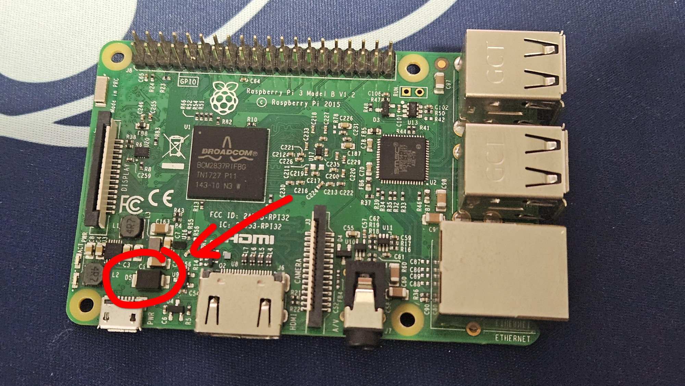
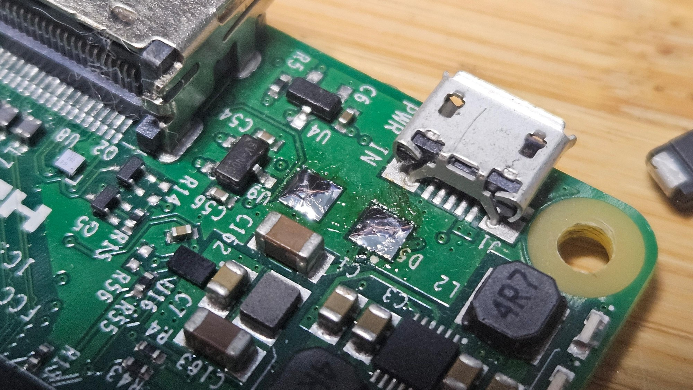
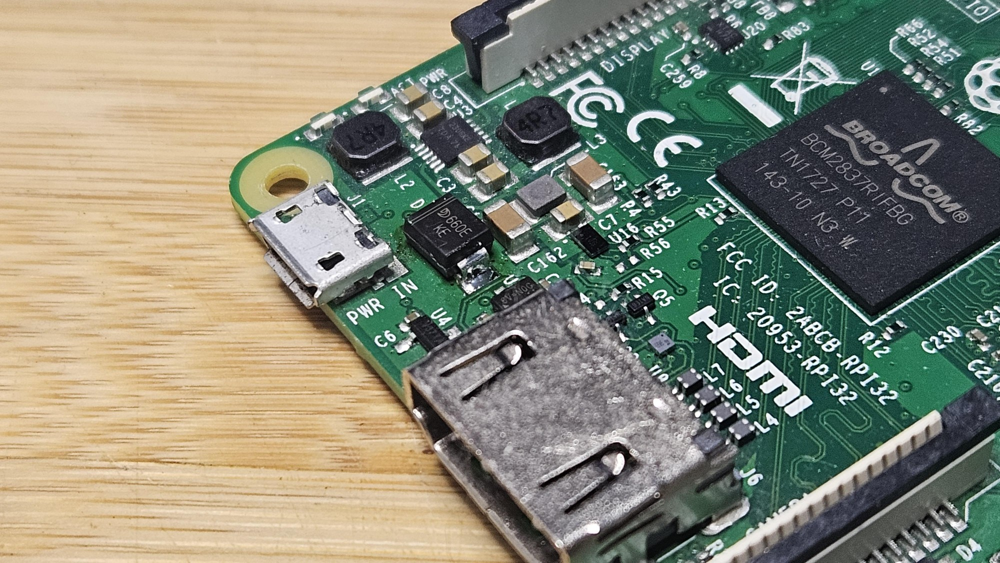
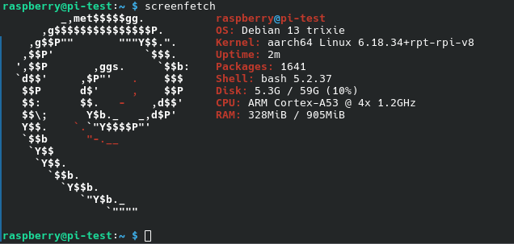

# Raspberry Pi

One of the better single board computers (SBC) you can get. Not because it's the best for the price, or has the best performance, but has that first party support where projects are built around it and you can rule out hardware as the thing having issues. 

## Acquisition

Someone I know was dumping a bunch of ewaste, and had a dead raspberry pi in the pile. I had a brief look, didn't see any corrosion, water damage, so suspected it was a dead component so took it.

## Diagnosis and Research

The item looked fine and free from defects, so I plugged it in. As is tradition, no LEDs or other signs of life were shown. I didn't notice anything awry immediately, but noticed the classic "burning electronics smell" that you get when you kill some components. I unplugged it immediately.

This was however informative, as it shows that the issue is a short circuit somewhere.

I plugged it back in and pressed my palm over the board to try to determine where the issue was coming from. This can lead to burns so be careful, I don't recommend it, but makes for a very cost effective thermal camera. This is also what I did to [fix a dead macbook pro 13" 2017 where a capacitor had failed short](../2024-a1708/repair.md).

The hotspot, after a few power cycles (to prevent it from getting too hot), was isolated down to a component labelled D5 on the board.

Through the power of open source, I was able to grab the schematic and determine what this mysterious component is.

This is immediately next to the micro USB port, which means that it's a power issue. Furthermore, as it's a short from the 5V rail to ground, it is highly unlikely to have killed components that are downstream from it. Great news and means that a repair is likely successful.

tldr: D5 (second from the right) is something that holds up power to be 5V. If D5 fails, no power ends up further downstream, hence not turning on or any other activity.

## Repair

Having done some SMT repairs and replacement, this was fairly straightforward. Remove component, replace component. To do it on the Pi was surprisingly easier than expected, likely due to the smaller ground plane and thus easier to heat the pads. All it took was a few weeks for the aliexpress replacement to arrive.

Rip it off

put a new one back on.

## Results

It boots up! Success

This was good fun, and shows that repair instead of replacement can be extremely effective, especially when component costs are sky high and the issue can be fixed easily. Not everyone has the technical skill for it, but the optionality for those who do is extremely powerful. Similar to how a car can be serviced by mechanics as parts and instructions are available, electronics can be serviced when parts and instructions are available.