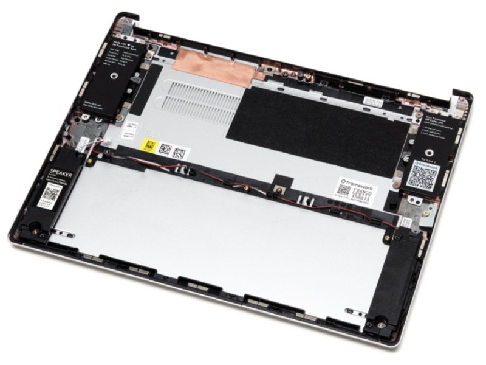
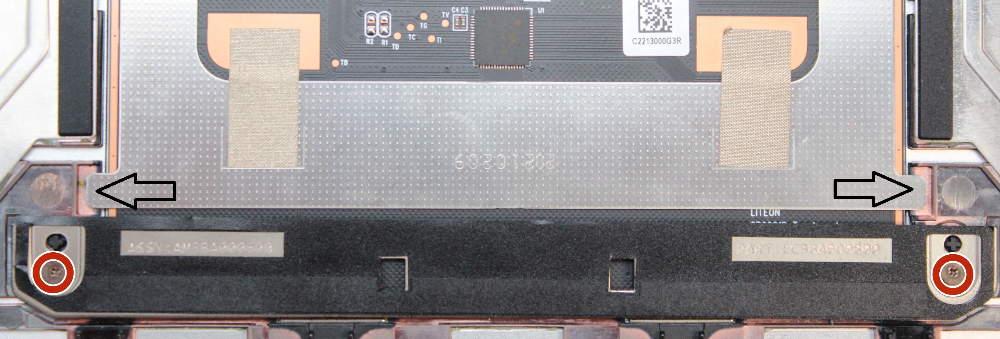
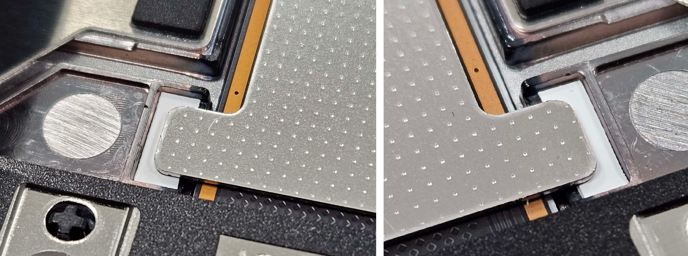
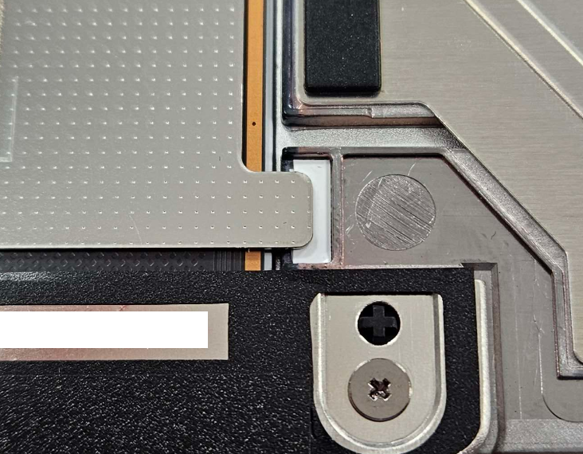
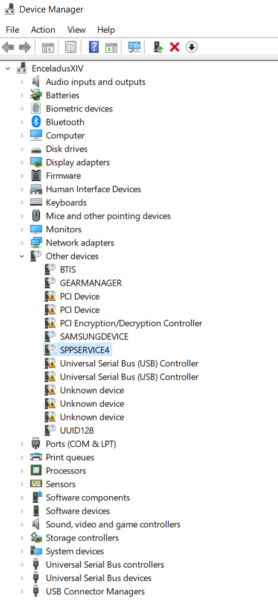
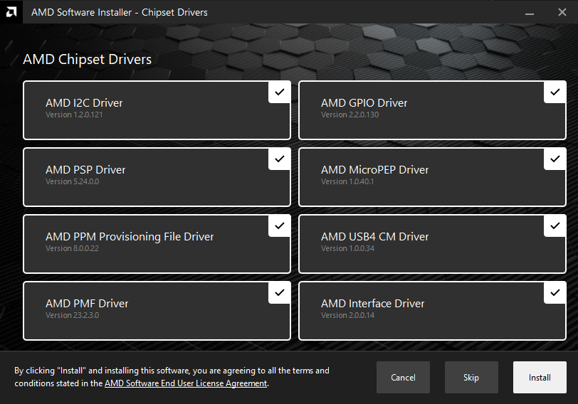

# The Framework Laptop

As some of you will know, Framework Computer Inc. has been on the scene for a few years now, but has made some notable headlines regarding their upgradable, customisable, and sustainable, laptop. The extent to which their goals have been achieved is uncertain, but the intent is to be applauded.

I have been considering replacing my current laptop, but to fully understand why, background is needed regarding my computer setup.

## My Computing Setup

I don't game, so my primary device is a laptop, as opposed to a desktop. By utilising a dock, I get almost all the benefits of a desktop (good ergonomics, ports, high quality monitors, keyboard, etc), with the benefits of a laptop (battery, portability as required, etc). Acknowledgement regarding performance and thermals, but none of my workload is intensive enough to warrant a desktop.

#### Laptop Docks

Laptop docks are amazing and I highly recommend them for most people, due to the benefits available outlined above. [This love letter](https://www.youtube.com/watch?v=Pc31L3zJiaU) from Technology Connections outlines them well, and match my priorities. 

The dock of choice for me is the Dell WD19TB, which has the added benefit of downstream Thunderbolt devices as supported with an additional USB C/TB3 port.

# Buying a New Laptop

The portability (or lack thereof) with the XPS 17 that I was taking issue with, along with a scholarship opportunity from my studies, aligned in such a way that I decided to refresh my laptop. The continual progress of technology allowed a newer, lower power and more portable computer, to be almost double the performance of the XPS in CPU (with GPU remaining about the same). Having used the XPS laptop for a while now, I had the following requirements for the new laptop:

 - AMD (performance per watt, Win10 compatibility)
 - 16:10 screen
 - USB4/TB3 compatibility with PCIe Passthrough (for the dock, and eGPU/ePCIe compatibility)

After looking at the main hardware vendors (Dell had excellent laptops from their Latitude lineup, but were intel only) (HP generally didn't have anything good in my region)(ASUS doesn't really have a presence in my region)(Acer is the same story as ASUS), the only viable options were a Framework Laptop (recently released in my region, but Intel only), and the Lenovo T14s Gen3 AMD. Given the options, I decided to go with the Lenovo, especially after having some hands on time with a friend's laptop, which was the exact model but with a lower spec CPU.

Purchased, arrived, and tried it out. It worked extremely well and had no issues, except for a flicker on the screen very occasionally, probably around once per hour. This would have been acceptable as a single frame display artifact, but as I primarily use the laptop whilst docked, it would disconnect and reconnect the displays, resulting in a blank screen for 3-5 seconds. This was unacceptable, so I asked for the laptop to be RMA'd and replaced.

The replacement laptop arrived with even more issues, specifically an inconsistent `e` key (unusable for typing on the go), and trackpad rattle. After these experiences, I returned the replacement and asked for a refund, which I got.

Overall, not a _horrible_ experience, given that the customer service was good, but still left a sour taste in my mouth. This saga did last 2 months, not great, _but_, in this time, Framework announced that the Framework 13 would receive an AMD version!!! After receiving the second Lenovo laptop and having these issues, I pre-ordered the Framework and paid the deposit.

## Buying a Framework Laptop

After just over half a year of waiting, Framework ramped up their laptop production and shipped my order. 

Framework 13 AMD
 - 7840U
 - RAM 32GB
 - BYO SSD (SN-570 1TB (WD Blue))
 - US English Keyboard (no Alt-GR compared to English Int'l)

A sidebar on laptop chargers. I've gotten really used to my XPS 17's Dell Charger, which is honestly phenomenal (other than it's complete lack of 9V, 12V, and 15V rails (yeah you read that right, it's 5V1A, or 20V6.5A, only.)) The physical build is great, and having a clip and rounded body allows the charger cord to be wrapped around the charger for storage/transport (yes I unwrap it during operation, don't want any unwanted inductance in the wrapping), and easily deployed. Due this good experience, I ordered a Dell 65W USB C charger, and skipped out on the Framework Charger. Downside is that the Dell isn't GaN, so quite large compared to what the Framework charger could be, but I'm ok with this sacrifice (it's not that important anyway, and is easily replaced by a newer, smaller, one, if I wanted to get one).

The SSD Choice was originally for the Lenovo laptop, as the configurator provided by them didn't allow for anything more than 512GB, and this has slowly becoming not enough for me. I selected the SN570 as one of the cheaper, low power consumption, high write tolerance, NVMe SSDs available in my region.

After using the AMD Framework for a while, I am happy to report back that it's been a joy to use, mostly. Note I am on bios version 3.03.

#### Overall Build Quality

The build of the chassis as a whole is phenomenal, aluminium parts, though the glued in plastic tabs and such are a bit questionable. I'm used to laptop internals using something that resembles cast aluminium, providing more strength and rigidity, and the choice of plastic within an aluminium outer shell is an interesting one. You can see where the plastics are used below.

The black plastics and brass insets for screws can be plainly seen (photo credit to Framework Team at [Support](https://guides.frame.work/Guide/Bottom+Cover+Replacement+Guide/107)).

Overall though, this doesn't impact rigidity, and it's on par with my XPS 17, and only slightly behind the Macbook Pro 2015.

The screen however, is a different issue. In all the video reviews, you can see how one side of the screen would be slanted from the other, and that remains a constant in my model. The screen rigidity is abysmal when compared to the rest of the chassis, likely due to the removable bezel. This is also likely why keyboard marks on the screen was very common with the glossy display. Hopefully taking care with it in my bag and having the matte display will let me avoid this.

#### Thunderbolt Compatibility on USB 4

Dock firmware `01.00.32, 01.00.16` (Released on 25 May, 2023) works without issue, but newer versions cause issues. Regardless of if it is to do with the USB 4 re-timers, or the dock itself, the end result is that it does not work \:\(

**Please note!!!** My AMD Framework Laptop does not play nice with WD19TB Firmware 01.00.24/01.00.36! It either doesn't recognise, or intermittently recognises, or works without issue, but next time you use the \*exact same dock\* in the \*exact same configuration\* it might not work. 

To revert firmware on Dell, run the firmware update utility from powershell with the `/f` flag. Eg: `.\DellDockFirmwarePackage_WD19_WD22_Series_HD22_01.00.16.exe /f`. Note that I'm running the 01.00.16 firmware update utility as I want the end resulting dock to be on firmware 01.00.16.

#### General USB 4 Thoughts

USB 4 has a bunch of "optional" features from Thunderbolt that _can_ be implemented. I'm still unsure as to exactly which ones are implemented in the FW. Overall, for my use case, it has been without issue, other than the driver saga outlined [here](#the-fw-amd-driver-saga).

#### Keyboard

I'll be honest, this was one of the places where I expected it to be lacking, but I was pleasently surprised. It's really nice compared to the XPS, having more travel, but slightly less tactile, and the larger keys are notably slightly mushy (especially the spacebar, but also backspace and enter suffer from this as well). Interesting is that both Shift keys don't suffer from this, but that could be based on the pinky finger being weaker than the others (especially thumbs). Overall very joyful to type on, and I could easily get to my normal typing speed on this keyboard. Also it helps that it's a smaller laptop, so my wrists naturally sit very nicely without the laptop body's edge digging into my wrists/arms.

#### Trackpad and Tape Mod

The trackpad arrived, not rattley, but had significant travel before the click would actuate. I'm pretty sure this is actually intended, as my XPS was similar (and notably did not suffer from a trackpad issue that plagued the XPS series). Regardless, this excessive travel was undesirable for me, and luckily, this laptop was made with servicability in mind! I decided to tape mod the trackpad.

Tape Modding the trackpad was quite simple, and I had also done this to my XPS laptop. It involves shimming (adding a thin material between two surfaces) the trackpad's diving board so that it sits lower, closer to the click, than stock default.

Adding tape to these two areas (black arrow)

(Image Credit to Framework's [Support](https://guides.frame.work/Guide/Touchpad+Replacement+Guide/90))

I used one layer of electical tape, and one of a generic sticker (totalling to around ~~0.32mm 0.22mm~~ 0.14-0.16mm of added thickness* (reduced thickness due to minor issues)), which was enough for my laptop. This manufacturing tolerance will vary, so different materials may be needed for your laptop, if you choose to do this. Furthermore, I don't recommend electrical tape on the top layer, as the slight rubber quality to the tape makes it stick, creating a fake "click" as the tab un-adheres from the tape.

\* using different thickness adhesives to try out what works. I'm currently using blank printable sticker paper.

This makes it feel much closer to the Macbook's Force Touch/Electro-vibratory trackpad, as it both reduces click force and click travel. I would recommend, but if you haven't used Mac trackpads, then it's probably unnecessary.

#### Lid Closed Thermals

When I run the laptop docked, I have the lid shut, and use the two monitors I have on my desk as the primary display outputs. I had heard issues with the Framework laptop having thermal issues with the lid shut, but I'm happy to report that the hinge gap is large enough for thermal exhaust to exit without issue. On a prolonged Cinebench run, the CPU peaked around 92 degrees C, settling down around 85 degrees. I have not repasted, and likely won't for quite a while.

Notably, the hinge gap on the bottom of the laptop exhaust the hot air almost directly downwards, which isn't great when the laptop is sitting on a table flat. I've been using 2 sticks of DDR3 RAM to prop up my XPS when it's being docked, but the Framework Laptop's feet are much closer to the center of the laptop than the XPS, as is the hinge exhaust vent, so a new solution is needed. 

I ended up measuring and drawing up a 3D printable "stand" for the FW laptop, which just props up the back for more intake and exhaust distance. Notably is that I wanted to separate the exhaust from the intake air to ensure that they don't mix (having hot exhaust be re-used as intake isn't great, like, it's ok if it happens, but you should avoid it), so it was a solid piece, and has a groove cut into it so the FW Laptop's rubber feet will sit nicely in the groove. It's width is designed to not interfere with intake and exhaust, and has sloped sides so the only thing that the stand is contacting is the laptop's feet.

If you wanna print your own, feel free to use [the CAD model here](FWlaptopProp.stl). I've just stuck it to my table using tack, but double sided tape would also work (note be careful about how removable your solution is).

#### Laptop Hinge

The laptop hinge is.... alright. It's _very_ springy, and not very well built. I _think_ it's over-tensioned which results in the the springy action. It's interesting, and could be thought of as a mass sprint damper system, though rotationally rather than lineally. Having a high $k$ value with a low $c$ value is most of the issue, though as I say this, I don't have a fix for it. 

As far as I can tell, Macs have insanely high $c$ values with a low $k$ value, resulting in a stiff ish hinge (mostly through the damper action, as opposed to spring action).

## The FW AMD Driver Saga

I had some issues with the FW AMD 13 on BIOS 3.03 with all of FW's [provided drivers](https://knowledgebase.frame.work/framework-laptop-bios-and-driver-releases-amd-ryzen-7040-series-r1rXGVL16) with compatibility with my WD19TB, and with booting.

This issue could be summarised by the enormous list of unrecognised/unknown devices that were present in Device Manager

#### Dock Issues

An issue that I was experiencing with the Framework Laptop was that when booting up from a shut down state (either shut down or hibernate, as hibernate is still powered off), the startup process would halt before detecting the screen. None of the FW expansion card debug LEDs showed anything*, and the caps lock key would not function, only the Power Button LED was lit. The solution was to hold down the power button for 7s or so until the system hard powered off, before releasing, and attempting to turn it on normally again. 

This would usually resolve the issue, but sometimes it would persist throughout multiple restarts.

~~*once I caught it blinking 3 times (likely toward the end of a debug sequence), but it did not repeat after waiting a few minutes.~~ I've caught it's sequence, which can be seen [here](#not-turning-on-sometimes)

#### Partial Solution

Download AMD's Drivers, but not the manual install of the `AMD Software: Adrenalin Edition` (23.11.1), but the Auto-Detect and Install tool. I was missing some really basic stuff like USB 4 CM, and I2C/SPI drivers for the chipset that were missing, and were not installed by the Adrenalin Edition download. The Auto-Detect and Install is _necessary_ for all functionality to work, which I wasn't told anywhere unfortunately.

Interestingly, the drivers that I was missing doesn't appear to be available as individual downloads, and needs to be installed through the "autodetect and install" method. :// _I_ dislike this, as I prefer manual control, but `¯\_(ツ)_/¯`

Notable is that this only fixed some issues and not others.

Fixed:
 - While docked, wake from sleep and detecting monitors
 - Detecting Ethernet while docked to WD19TB
 - Detecting USBs when plugged into Dock
 - Detecting eGPU devices

Not Fixed: 
 - Not turning on sometimes.

This is still pending Framework Support, which I'll update when notable things happen.

#### Not Turning on Sometimes 

Pressing the power button, OR plugging in the laptop (I have Wake on AC Attach enabled) yields the same result outlined below. All of the below occur.

 - Power Button LED Lights Up
 - No Display on screen (no splash screen logo)
 - Caps lock key does not respond
 - SOMETIMES the debug led (next to expansion modules) will blink the following code after about a minute of idle in this vegetative state:
    - 1x White
    - 12x Green
    - 1x Red
    - 1x Blue
    - 7x Green

They are not affected by:
 - If the laptop is docked when powering on
 - If the laptop was docked when shutting down
 - If the laptop is currently plugged into a charger or not
 - If any expansion modules are inserted
 - If Windows 10 or 11 is installed
 - If any SSD is installed

I have:
 - Reseated the Input Cover
 - Reseated the RAM
 - Swapped RAM sticks around (stick that was in slot 0 is now installed in slot 1 and vice verca)
 - Reseated the SSD
 - Swapped around expansion modules
 - Reseated the Display Connector
 - Reset the BIOS (Pressing on SW3's levelr 10 times slowly (once per second or so))
 - Re-updated the BIOS (3.03 &rarr; 3.03)
 - Reseated the Battery Connector 

To "fix" this, you hold down the power button for 9 seconds, hard shutting down the system, and then try to turn it back on. Sometimes this will fix the issue, but sometimes the above will occur, multiple times, before a successful boot. There does not appear to be any correlation as to why it occurs. 

Notably, restarting the system has never failed, but shutting down and immediately trying to re-power it on sometimes yields the symptoms outlined above.

If anyone has any suggestions or ideas as to what could be doing this, a pull request or creating an issue would be greatly appreciated!

## Framework Support

Good service, but took a lot of back and fourth to diagnose/troubleshoot the issue unfortuantely. A lot of this I can chalk up to the multitude of modules and possible failure points to be considered, but did make for a slightly unpleasant experience, especially since support would ask you to test only one thing at a time. It's probably a feature from support's perspective where the end user's skill/experience is unknown, but was a bit tedious for me personally.

Overall though, a great experience, especially since they send you the replacement, and _then_ ask you to return the faulty device. This lets you still have a (broken, but) functional computer while waiting for shipping, as opposed to Lenovo, which makes you send back the system first before they ship, meaning that you might be out of luck in terms of having a usable computer for months as you wait for shipping.

## Replacing the Motherboard

Went smoothly, followed the guide provided at [framework guides](https://guides.frame.work/Guide/AMD+Ryzen+7040+Series+Upgrade+Overview/205?lang=en).

Notable points:
 - Had to reinstall drivers wholly (FW Provided bundle + AMD OEM (as mentioned [above](#the-fw-amd-driver-saga)))
 - The physical board is so thin! I'm used to the thicker circuit boards, but this one is just... feels so fragile.
    - The FW Motherboard is 1mm thick (same as m.2 drives)
    - For reference, PCIe devices have a board thickness of 1.6mm

## Footnotes

If you're keeping track, I've had issues with three laptops in a row this year having defects/issues, with the fourth one finally fixing everything, just in time for new years. 