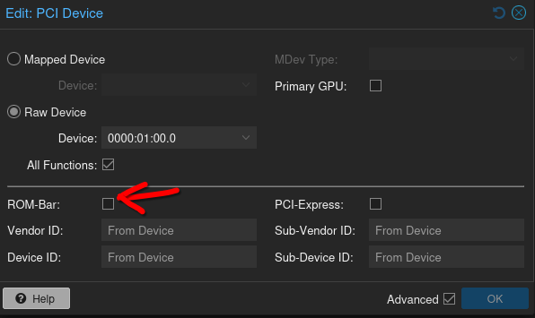

# My Setup and Other Things

~~I daily windows, so WSL, and am actively working to move to Linux (debian) for my daily driver (laptop).~~

I've now moved over to Debian/KDE as my daily driver!

List of issues that were stopping me from moving to Linux:
 - CAD Program Support (VM solved)
 - AutoHotKey alternative (.zshrc solved for the most part, moving away from Discord also helped)
 - Logi Options+ alternative (KDE Plasma has support for thumb-buttons, but does not support rebinding the 3rd button behind the scroll wheel on the MX Anywhere 3)


## Basic linux setup

```sh
# basic programs that I use
sudo apt install curl wget vim htop screen sysstat smartmontools ffmpeg git unzip dnsutils glances screenfetch

# install zsh
sudo apt install zsh
# install oh-my-zsh for customisation
sh -c "$(curl -fsSL https://raw.githubusercontent.com/ohmyzsh/ohmyzsh/master/tools/install.sh)"
# install powerlevel10k and set as zsh theme
git clone --depth=1 https://github.com/romkatv/powerlevel10k.git ${ZSH_CUSTOM:-$HOME/.oh-my-zsh/custom}/themes/powerlevel10k
sed -i 's/ZSH_THEME=.*/ZSH_THEME=powerlevel10k\/powerlevel10k/' ~/.zshrc
# get zsh autosuggestions and add to .zshrc plugins
git clone https://github.com/zsh-users/zsh-autosuggestions ${ZSH_CUSTOM:-~/.oh-my-zsh/custom}/plugins/zsh-autosuggestions
sed -i "s/^plugins=(/plugins=(\n    zsh-autosuggestions\n    /" ~/.zshrc
# install zsh-syntax-highlighting
sudo apt install zsh-syntax-highlighting
echo "source /usr/share/zsh-syntax-highlighting/zsh-syntax-highlighting.zsh" >> ${ZDOTDIR:-$HOME}/.zshrc
# set as default shell
chsh -s $(which zsh)


# set up vim to be default terminal editor
sudo update-alternatives --config editor
# vim default git editor
git config --global core.editor "vim"
```


### Change Grub Timeout
Grub's timeout. If >0, requires keyboard to be connected when booting. If =0, doesn't
```sh
sudo sed -i 's/GRUB_TIMEOUT=.*/GRUB_TIMEOUT=0/' /etc/default/grub
sudo update-grub
```


### GUI Programs
Requires external repos/pgp keys that may change.
- [Sublime Text](https://www.sublimetext.com/docs/linux_repositories.html)
- [Firefox](https://support.mozilla.org/en-US/kb/install-firefox-linux#w_install-firefox-deb-package-for-debian-based-distributions-recommended)

```sh
sudo apt update
# gui programs that I use
sudo apt install gparted vlc obs-studio firefox-nightly firefox-devedition sublime-text 
```
- [gqrx](https://github.com/gqrx-sdr/gqrx/releases)
- [ATLauncher](https://atlauncher.com/downloads)
- [VSCode](https://code.visualstudio.com/docs/setup/linux)


#### yt-dlp

[Download](https://github.com/yt-dlp/yt-dlp)
```sh
cd ~
echo '\n\n'alias :yt-dlp=\'/home/$USER/yt-dlp --no-overwrites --merge-output-format \"mkv\" --output \"'%(upload_date)s - %(title)s-%(id)s.%(ext)s'\"\'  >> .zshrc
```


#### Virtualbox

[VirtualBox](https://www.virtualbox.org/wiki/Linux_Downloads)

```sh
# sudo apt install virtualbox
sudo mkdir -p /var/lib/shim-signed/mok
sudo openssl req -nodes -new -x509 -newkey rsa:2048 -outform DER -addext "extendedKeyUsage=codeSigning" -keyout /var/lib/shim-signed/mok/MOK.priv -out /var/lib/shim-signed/mok/MOK.der
sudo mokutil --import /var/lib/shim-signed/mok/MOK.der
# sign kernel modules
sudo /usr/src/linux-headers-$(uname -r)/scripts/sign-file sha256 ./MOK.priv ./MOK.der /usr/lib/modules/6.1.0-37-amd64/misc/vboxdrv.ko
sudo /usr/src/linux-headers-$(uname -r)/scripts/sign-file sha256 ./MOK.priv ./MOK.der /usr/lib/modules/6.1.0-37-amd64/misc/vboxnetadp.ko
sudo /usr/src/linux-headers-$(uname -r)/scripts/sign-file sha256 ./MOK.priv ./MOK.der /usr/lib/modules/6.1.0-37-amd64/misc/vboxnetflt.ko
# sudo reboot
# only need to reboot if not also adding video loopback devices below.
```


#### Get Video Loopback Devices Working
Need to perform MOK management

```sh
sudo apt install v4l2loopback-dkms
sudo openssl req -new -x509 -newkey rsa:2048 -outform DER -keyout /var/lib/shim-signed/mok/MOK.priv -out /var/lib/shim-signed/mok/MOK.der -nodes -days 36500 -subj "/CN=v4l2ModuleKey/"
sudo /usr/src/linux-headers-$(uname -r)/scripts/sign-file sha256 /var/lib/shim-signed/mok/MOK.priv /var/lib/shim-signed/mok/MOK.der /lib/modules/$(uname -r)/updates/dkms/v4l2loopback.ko

sudo mokutil --import /var/lib/shim-signed/mok/MOK.der
sudo reboot
```

At the boot screen:
- Choose "Enroll MOK"
- Select "Continue"
- Choose "Yes"
- Enter the password you set earlier

```sh
sudo modprobe v4l2loopback
```


### Framework Laptop

Use the [debian guide](https://wiki.debian.org/InstallingDebianOn/FrameWork/Laptop13/AMD_7040_Series) first.

REMEMBER to fix display drivers FIRST!!!


#### KDE Settings to change.

- Appearance: Breeze Dark
- Workspace Behaviour > General: Animation Speed: 3/4 -->
- Workspace Behaviour > General: Clicking files or folders: Selects them
- Workspace Behaviour > Screen Edges: Top Left, Nothing
- Input Devices > Mouse > MX Anywhere: Enabled
- Input Devices > Mouse > MX Anywhere: Acceleration: Flat
- Input Devices > Mouse > MX Anywhere: Disable Invert Scroll
- Input Devices > Mouse > MX Anywhere: Scroll Speed: 5th from the left
- Input Devices > Mouse > MX Anywhere: Rebind buttons as you see fit
- Input Devices > Touchpad: Tap to Click
- Input Devices > Touchpad: Two finger tap: Right click 
- Input Devices > Touchpad: Invert scroll direction
- Input Devices > Touchpad: Scroll Speed 2nd from left
- Input Devices > Touchpad: Right Click: press anywhere with 2 fingers
- Power Management > AC Power: Disable suspend session


#### Fingerprint Reader

```sh
sudo apt install fprintd libpam-fprintd
sudo pam-auth-update
```
BUT remember to add this to `/etc/pam.d/sddm` after the first `auth` lines to ensure you can login.
```sh
#auth            something       something blah
# fingerprint-testing stuff
auth            [success=1 new_authtok_reqd=1 default=ignore]   pam_unix.so try_first_pass likeauth nullok
auth            sufficient      pam_fprintd.so
```


#### LUKS and TPM2 AutoUnlock

```sh
sudo apt install tpm2-tools
sudo apt install libtpm2-pkcs11-1
sudo apt install dracut

# delete previous tpm settings, set it to 1+7, and require pin
# https://man.archlinux.org/man/systemd-cryptenroll.1
sudo systemd-cryptenroll --wipe-slot tpm2 --tpm2-device auto --tpm2-pcrs "1+7" --tpm2-with-pin=yes /dev/nvme0n1p3
```

edit `/etc/dracut.conf` so it just contains:

```sh
add_dracutmodules+=" tpm2-tss crypt "
```

edit `/etc/dracut.conf.d/tss2.conf

```sh
install_optional_items+=" /usr/lib64/libtss2* /usr/lib64/libfido2.so.* " 
```

`/etc/default/grub` and replace that line with:
```
GRUB_CMDLINE_LINUX="rd.auto rd.luks=1"
```

`/etc/crypttab` and comment out the line.
```
## nvme0n1p3_crypt UUID=****-****-*** none luks,discard
```

```sh
dracut -f
update-grub
```

Reboot.


To delete: 
```
sudo systemd-cryptenroll --wipe-slot=tpm2 /dev/nvme0n1p3
```

helpful command when chrooted if you break the install.
```
dracut --regenerate-all --force
```


### Chroot into a device with LUKS using TailsOS

```sh
sudo fdisk -l
# /dev/nvme0n1p1: EFI
# /dev/nvme0n1p2: /boot
# /dev/nvme0n1p3: / (encrypted)

sudo cryptsetup open /dev/nvme0n1p3 temp-name-here

sudo mount /dev/mapper/temp-name-here /mnt
cd /mnt
sudo mount /dev/nvme0n1p2 boot/
sudo mount -t proc /proc proc/
sudo mount --rbind /dev dev/
sudo mount --make-rslave dev/
sudo mount --rbind /sys sys/
sudo mount --make-rslave sys/
sudo chroot .
```


### Set up git

```sh
# install repo
# https://github.com/cli/cli/blob/trunk/docs/install_linux.md
gh auth login
gh auth setup-git
```

```sh
git init
git pull https://repo/address
git remote add origin https://repo/address
git push --set-upstream origin master
```

### Change Around Mac's God Awful Key Layout

This swaps `fn` with `ctrl`, and swaps `alt` with `meta`. It also changes function keys to default to F1-12 as opposed to brightness/etc.

```sh
sudo vim /etc/modprobe.d/hid_apple.conf

# append this to file
options hid_apple fnmode=2
options hid_apple swap_fn_leftctrl=1
options hid_apple swap_opt_cmd=1

# regenerate initramfs
sudo update-initramfs -u
#sudo mkinitcpio -p linux # for kali
```


### Kali Install

When installing Kali Linux on a MacbookPro12,1 using Rufus, write in GPT, DD mode, not ISO

```sh
# ctf tools
sudo apt install libimage-exiftool-perl binwalk basez qpdf nmap traceroute wireshark python-is-python3 python3-pip netcat-traditional ncat 
```


### Samba Share Setup

```sh
sudo apt install samba
mkdir ~/share

sudo vim /etc/samba/smb.conf

## append
[share]
    comment = Samba Shared Folder
    path = /home/[username]/share
    read only = no
    browsable = yes
# write exit file

sudo service smbd restart
sudo ufw allow samba

sudo smbpasswd -a [user]
```

### Samba Client Setup
Install software to do this

```sh
sudo apt install autofs cifs-utils smbclient
```


Configure autofs master file to point at auto.smbmedia file

`sudo vim /etc/auto.master`
and add `/- auto.smbmedia` above `+auto.master`

Add your credentials

`vim ~/.smb.credentials`
```
username=username-here
password=password-here
```
and make sure only you can read it `chmod 600 ~/.smb.credentials`

Add relevant files to the `auto.smbmedia` file which we pointed autofs at earlier. One entry per line if adding more than one line.

`sudo vim /etc/auto.smbmedia`
```sh
/mnt/remote/${SHARENAME} -fstype=cifs,uid=1000,gid=1000,credentials=/home/${USER}/.smb.credentials,rw ://${IP.ADDRESS}/${SERVER_SHARE_NAME}
```

Restart autofs and check if it's mounted in `/mnt/remote`
```sh
systemctl restart autofs
```

Credit to [ThatGuyB](https://forum.level1techs.com/t/easy-to-follow-samba-autofs-mount/178658).


### Static IP 

```sh
sudo vim /etc/network/interfaces

## change your default ethernet interface (eno0 for this example)
auto eno0
iface eno0 inet static
    address 192.168.X.Y
    netmask 255.255.255.0
    gateway 192.168.X.X
# use whatever your network uses
# write exit
```


### Python pip fix

```sh
sudo mv /usr/lib/python3.11/EXTERNALLY-MANAGED /usr/lib/python3.11/EXTERNALLY-MANAGED.old
```


### LaTeX Installation

```sh
# add keyring
curl -fsSL https://miktex.org/download/key | sudo tee /usr/share/keyrings/miktex-keyring.asc > /dev/null
# add source
echo "deb [signed-by=/usr/share/keyrings/miktex-keyring.asc] https://miktex.org/download/debian bookworm universe" | sudo tee /etc/apt/sources.list.d/miktex.list
# install
sudo apt-get update
sudo apt-get install miktex
# finish install
miktexsetup finish 
# configure to download packages as needed
initexmf --set-config-value="[MPM]AutoInstall=1"
# install pdflatex
sudo apt install texlive-latex-base texlive-fonts-recommended texlive-fonts-extra texlive-latex-extra
```

Fix pygmentize

```sh
pip3 install pygments
# add to path if not already
#export PATH="$PATH:/home/[USERNAME]/.local/bin"
pygmentize -V
```


### Surface Go TPM LUKS
```sh
#!/bin/bash

#install needed packages
apt-get -y install clevis clevis-tpm2 clevis-luks clevis-initramfs initramfs-tools tss2

#proceed
echo -n Enter LUKS password:
read -s LUKSKEY
echo ""

clevis luks bind -d /dev/nvme0n1p3 tpm2 '{"pcr_bank":"sha256"}' <<< "$LUKSKEY"

update-initramfs -u -k all

#check
clevis luks list -d /dev/nvme0n1p3

#delete example; -s is one of the slots reported by the previous command
#clevis luks unbind -d /dev/nvme0n1p3 -s 1 tpm2
```
Gnome Fractional Scaling
```sh
gsettings set org.gnome.mutter experimental-features "['scale-monitor-framebuffer']"
```

## Proxmox Setup

### DHCP Setup

Credit to [lkiesow](https://weblog.lkiesow.de/20220223-proxmox-test-machine-self-servic/proxmox-server-dhcp.html)

edit `/etc/network/interfaces`
```
iface vmbr0 inet static
        address 192.168.1.157/24
        gateway 192.168.1.1
        bridge-ports enp5s0
        bridge-stp off
        bridge-fd 0
```
Modify into:
```
iface vmbr0 inet dhcp
        bridge-ports enp5s0
        bridge-stp off
        bridge-fd 0
```

Check Hostname
```sh
hostname
$hostname
```
Confirm Hostname
```sh
hostnamectl set-hostname $hostname
```
Confirm the hostname is entered correctly in `/etc/hosts`
```
127.0.0.1      localhost.localdomain localhost
192.168.1.157  $hostname $hostname.proxmox
```
Script for DHCP `/etc/dhcp/dhclient-exit-hooks.d/update-etc-hosts`
```sh
if ([ $reason = "BOUND" ] || [ $reason = "RENEW" ])
then
  sed -i "s/^.*\sproxmox.home.lkiesow.io\s.*$/${new_ip_address} proxmox.home.lkiesow.io proxmox/" /etc/hosts
fi
```

### Disk Wear

Proxmox usually eats drives. Run these to disable.

```sh
systemctl disable --now pve-ha-crm.service
systemctl disable --now pve-ha-lrm.service
systemctl disable --now pvesr.timer
systemctl disable --now corosync.service 
```

### PCIe Passthrough

`sudo vim /etc/default/grub`
```
GRUB_CMDLINE_LINUX_DEFAULT="quiet intel_iommu=on"
```
`sudo update-grub`


Append this to `/etc/modules`
```
vfio
vfio_iommu_type1
vfio_pci
vfio_virqfd
```

```sh
update-initramfs -u -k all
```

Reboot.

Check if enabled.

```sh
dmesg | grep IOMMU
```
Looking for
> IOMMU enabled

Good. It is now enabled.

```sh
lspci -nn
```
and note down the vendor and device IDs. eg. 
```
01:00.0 SATA controller [0106]: ASMedia Technology Inc. ASM1061/ASM1062 Serial ATA Controller [1b21:0612] (rev 02)
        Subsystem: ASMedia Technology Inc. Device [1b21:1060]
```
we want `1b21:0612`

`vim /etc/modprobe.d/pve-blacklist.conf` and append

```
options vfio-pci ids=1b21:0612
```

```sh
update-initramfs -u -k all
```
Reboot

It should now be ready to passthrough.

When passing through, select `Raw Device`, and REMEMBER TO DISABLE ROMBAR. Pls.




## Darwin USB Creation

On mac cause apple hates you

Copy `.dmg` to a mac and open directory in finder. Run `.dmg` and let the volume mount.

```sh
pkgutil --expand-full “/Volumes/<version>/InstallMacOSX.pkg” OSInstaller
```
where `<version>`
- for For Lion and Mountain Lion: `Install Mac OS X`
- For Yosemite and El Capitan: `Install OS X`
- For Sierra: `Install macOS`

1. Open OSInstaller, right click `.pkg` file -> show content package -> Copy `InstallESD.dmg`
2. Go to Payload -> right click on App installer -> show Package content -> Contents -> SharedSupport, Paste
3. Payload folder, then copy the `.app` file into Host OS Application folder
```sh
sudo /Applications/Install\ [Version].app/Contents/Resources/createinstallmedia --volume /Volumes/MyVolume --applicationpath /Applications/Install\ [Version].app
```

### If that doesn't work
1. On a handy Mac, grab Lion installer from Apple website here: https://support.apple.com/kb/DL2077?locale=en_GB

2. Open the DMG. Copy the PKG file somewhere, then use The Unarchiver to extract it.

3. In the extracted contents, there's another PKG file called InstallMacOSX.pkg. Right click on that and click "Show Package Contents". There's a DMG in there called InstallESD.dmg. Open that DMG to mount it.

4. Put a USB stick into your Mac and open Disk Utility. I'm on a Mac with High Sierra at the moment, earlier or later versions will look different. Find your USB stick and click the Erase button. Format it with Mac OS Extended format and choose the GUID Partition Map scheme. Give it any label you like.

5. Find your newly formatted USB Stick volume in the Disk Utility, right click on it and press Restore. Tell it to restore from "Mac OS X Install ESD", then press the Restore button.

6. Wait an indeterminable amount of time for the DMG to get restored to the USB Stick. It should then turn into a Lion USB stick and be bootable. Plug it into the Mac you want to install Lion on, reboot it while holding down the Option key and wait for the boot menu to appear. With luck and a following wind, you should see the Lion installer in your bootable image list.

[Credit](https://www.edugeek.net/forums/topic/207160-ok-i-give-up-how-do-i-get-a-lion-into-a-macintosh/)

## Misc Windows Commands

### Delete Cortana (Win10 only)

Powershell

```powershell
Get-AppxPackage -allusers Microsoft.549981C3F5F10 | Remove-AppxPackage
```

### Delete Other Windows 10 Bloat

Powershell

```powershell
Get-AppxPackage *phone* | Remove-AppxPackage
Get-AppxPackage *xbox* | Remove-AppxPackage
Get-AppxPackage *feedback* | Remove-AppxPackage
Get-AppxPackage *tv* | Remove-AppxPackage
Get-AppxPackage *film* | Remove-AppxPackage
Get-AppxPackage *calendar* | Remove-AppxPackage
Get-AppxPackage *camera* | Remove-AppxPackage
Get-AppxPackage *alarm* | Remove-AppxPackage
Get-AppxPackage *help* | Remove-AppxPackage
Get-AppxPackage *groove* | Remove-AppxPackage
Get-AppxPackage *maps* | Remove-AppxPackage
Get-AppxPackage *mixed* | Remove-AppxPackage
Get-AppxPackage *solit* | Remove-AppxPackage
Get-AppxPackage *people* | Remove-AppxPackage
Get-AppxPackage *3D* | Remove-AppxPackage
Get-AppxPackage *experience* | Remove-AppxPackage
```

### Kill WSL

Powershell

```powershell
taskkill /F /im wslservice.exe
```

### wslconfig

C:/Users/USER/.wslconfig

```conf
# Settings apply across all Linux distros running on WSL 2
[wsl2]

# Limits VM memory to use no more than 4 GB, this can be set as whole numbers using GB or MB
memory=4GB 

# Sets the VM to use two virtual processors
processors=2

```

### Delete 3D Objects

Open Registry Edit.

Go to

`Computer\HKEY_LOCAL_MACHINE\SOFTWARE\Microsoft\Windows\CurrentVersion\Explorer\MyComputer\NameSpace\`

Delete `0DB7E...`.

Go to

`Computer\HKEY_LOCAL_MACHINE\SOFTWARE\WOW6432Node\Microsoft\Windows\CurrentVersion\Explorer\MyComputer\NameSpace\`

Delete `0DB7E...`.

Then, Task Manager, restart File Explorer.


## Arch (legacy)

Before installing, refresh pacman keys cause the ones in the iso were out of date.

```sh
pacman-key --refresh-keys
```

I used archinstall, couldn't get bootloaders to work on my Mac (I personally blame the mac).

```sh
archinstall
```

Once installed chroot in and install the following before exiting out of the install environment.

 - Display Server: Xorg
    - `sudo pacman -Ss xf86-video-intel` (for Macbook Pro 12,1)
 - DE: KDE Plasma (with Konsole as terminal window, and of course vim)
    - `sudo pacman -S sddm plasma-desktop konsole vim`
 - Display Scaling
    - `sudo pacman -S kscreen`
 - Wifi
    - `sudo pacman -S plasma-nm`
 - Audio
    - `sudo pacman -S plasma-pa`
 - Shell: [zsh](#shell)

Reboot

Start DE:
```sh
sudo systemctl enable sddm
sudo systemctl start sddm
```

### Frequently used packages

```sh
sudo pacman -S vim htop ffmpeg perl-image-exiftool screen binwalk qpdf nmap traceroute neofetch wireshark-qt curl wget smartmontools
```
```sh
sudo yay -S basez ulauncher 
```
