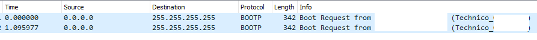

# Hacking Technicolor Gateways

For the content here, I am indebted to the work done by the folks at [Hacking Technicolor Gateways](https://hack-technicolor.readthedocs.io/), who have a much deeper understanding of the topic, and provide far more resources and support than I am able to here.

## Background

ISP provided modem/router/firewall/switch/ap boxes are quite commonplace, but can be quite locked down and difficult to customise. I so happen to have a few of these (model number DJA 0231) that were heavily locked down by the ISP, and the goal was to enable more functionality for these boxes, hopefully resulting in features similar to third party boxes (such as those from ASUS, TP-Link, etc).

I've done this exact procedure previously, likely in late 2020 or early 2021, but had far less experience doing this, and only exploited Type II firmware. This time I have more of an idea of what's going on.

### Notes Before we Begin

DJA 0231 has two "banks" of firmware, which can be thought of as two partitions. From my understanding, Bank I contains a clean/backup "factory default" version of the firmware, and Bank II contains the one that is loaded and run. When a factory reset is performed, the box copies data from Bank I to Bank II, then boots from Bank II. There's more nuiance here regarding how factory reset affects banks and switching between the two, and it's best to refer to [the "official(?)" guide](https://hack-technicolor.readthedocs.io/en/stable/Recovery/#change-booted-bank) for more information about this.

#### Firmware Types

The firmware being run by these boxes are catergorised into 3 different types.

 - Type I
 - Type II
 - Type III

Type I firmware can be flashed through the web UI, uploading a (valid) firmware file, and the box will do the flashing for you. This can be used to get the box to run type II firmware.

Type II firmware are the onle type vulnerable to exploits, used to enable root access and thus unlock functionality.

Type III firmware cannot be flashed traditionally. It needs to first flash Bank I firmware to Type II over IP, then exploit this firmware to get shell, then copy Bank I to Bank II. The box should now boot from Bank II.

## Flashing Type I Firmware

This was not done, as the boxes in my posession were Type II and Type III.

## Flashing Type III Firmware

So painful! This uses unintentional bugs/features of the gateway to flash Bank I (over IP) with Type II firmware, and then exploiting. It's knonw as [BOOTP Flashing](https://hack-technicolor.readthedocs.io/en/stable/Recovery/#bootp-flashing), after the protocol that it uses (bootp).

The firmware version for the gateway I had was `20.3.c.0501-MR22.1-RA` (Type III). The plan is to downgrade the firmware to `20.3.c.0389-MR20-RA` (Type II), then exploit and get root, then re-upgrade to `20.3.c.0501-MR22.1-RA` whilst retaining root access.

To do so, I copied over a [portable tftp server](https://pjo2.github.io/tftpd64/) to flash, but struggled to do so for quite a few hours. I tried changing the booted bank to Bank I just to check, in case Bank I wasn't updated and was still on Type II firmware. Unfortunately, this was not the case, and they were both on the newest version (`0501-MR22.1`). 

In frustration, I grabbed a fresh download of the tftp server (noting that I re-used the tftp config file when I copied over from an older project), re-attempted, and it finally worked. Being very careful to not turn the box off, I changed over the connections to another computer to run the exploit and get shell access.

Notable with the tftp server configuration was a quirk I had experienced. When the ethernet cable was disconnected, the ethernet interface would not request a DHCP address, resulting in no IP being assigned, and the selected interface resetting to loopback (127.0.0.1). To rememdy this, I connected it to another computer, hence forcing the DHCP server to hand out appropriate addresses, and locking the "Server interfaces" to the correct interface. After this, I connected it to the modem and flashed the firmware.

### BOOTP mode

BOOTP is an older version of DHCP, and is used by these boxes when flashing firmware over tftp. To put a DJA 0231 into bootp mode,

 - Start with a completely off box
 - Hold down the reset button
 - Plug in the box
 - Wait until the front light flashes repeatedly
 - Release the reset button

It should then send out bootp requests over a LAN interface (I used LAN 2), which the tftp/dhcp server should respond with.

As long as the front light is flashing, the box is sending out bootp requests.

## Obtaining Shell on Type II Firmware

Type II software wasy relatively easy to exploit. BoLaMN provides an (extremely easy script)[https://github.com/BoLaMN/tch-exploit] to accomplish this. Essentially:

 - Change computer IPv4 address to 58.162.0.1
 - Plug computer cable into box's WAN
 - Run script and follow on-screen instructions

That is all. You will(should?) get root access over ssh. (credentials `root`/`root`).

The IP address appears to be owned by Telstra, likely so that they are able to conduct over-the-air updates.

The need to press the WPS button is interesting and notable.

## Changing Banks

The method I used to change the boot bank was the [Timed Reset Button Action](https://hack-technicolor.readthedocs.io/en/stable/Recovery/#timed-reset-button-action) method, holding down the reset button for 10 seconds at a time, during a specific duration of the boot sequence (when the LED indicator was dim). 

, which did not work originally counting in my head, or utilising my computer clock (which showed seconds). In these cases, the box would continue booting without restarting the boot process (re-starting the boot process was required for this exploit). The only method that worked was using a phone timer to time the duration of when the reset button was held down, 

## Running Shell Scripts to Unlock Functionality